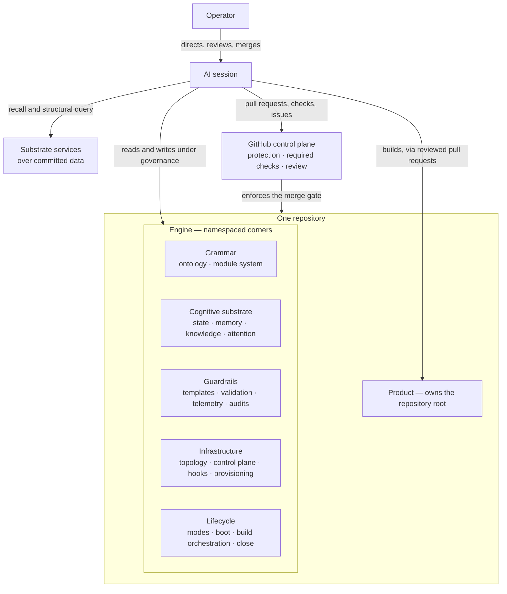

# Architecture

## What the engine-template is

A GitHub repository template that, when used to generate a new repository, ships a fully operative,
AI-driven Engine: the apparatus a cold-booting AI session needs to start correct work on any
project and earn the trust of a capable operator who builds through it rather than by reading its
code. A human engineer carries state, memory, knowledge, attention, and review habits in their
head; the AI starts every session with an empty context window. The engine externalizes that entire
substrate into the repository so continuity, quality, and reversibility survive across many
stateless sessions — with the burden of proof on the engine, not the reader.

## Topology: engine, product, instance

One repository holds three estates. The **engine** confines itself to its namespaced corners — its
committed machinery, governance surfaces, and shipped contracts — and travels whole wherever the
repository goes. The **product** owns the repository root; the dependency arrow runs
engine → product and never the reverse, so the product ships and runs standalone. The **instance**
is what a deployment accumulates and never ships onward: experiential memory, derived indexes,
per-project configuration and overrides — preserved across engine upgrades, absent from the
template.

The engine reaches a project three ways. **Greenfield:** template generation copies the tree, and a
one-time first run applies the platform settings files cannot carry and reconciles a narrow named
set of product-owned root files exactly once — seeding the product's own front matter and clearing
the traveled template license rather than letting the product inherit a foreign copyright
(ADR-0005). **Brownfield:** the same overlay machinery installs the engine's
namespaced files onto a live, populated product repository. **External contribution:** the engine
works from a fork of an upstream the operator does not own.

Within the engine, a small always-on core is separated from installable modules by an operational
test — remove every module; what survives is core — with containment earned by wiring discipline at
the shared seams, never granted by the modular shape (ADR-0003).

## Runtime flows

**Session: boot → work → close.** Every session starts grounded: a bounded boot assembled from
committed files orients the AI — current state, recent decisions, open work, standing alarms — and
lands it in the default exploratory stance, where engine and product writes are gated off. The boot
succeeds from tracked files even when every substrate service is down. Leaving the stance is a
deliberate human act; work then proceeds under the stance's gates, and close settles the record —
state, memory, open items — before the session ends, so the next cold session inherits the ground.

**Build: draft pull request to merge.** A build claims its work by opening a draft pull request, so
the claim is visible before anything lands. Implementation proceeds under validation and the
plan-review and pre-submission review gates; as the final authoring step, every derived-committed
artifact is regenerated from the reconciled tree, so the operator never meets a spurious conflict
(ADR-0004). The pull request is then submitted for the operator's
review — informed consent on evidence, never code reading — and the protected-branch merge is the
one unbypassable gate.

**Engine upgrade.** A generated repository is detached from the template — improvements do not
arrive by pull. On request, the engine's own updater fetches a tagged release and overlays only
engine-owned paths, preserving operator configuration, per-project overrides, and instance data,
and never resurrecting a deselected module; migrations run, and the whole upgrade lands as a
reviewed pull request through the same merge gate as any other change.

**Outbound contribution.** To contribute to a repository the operator does not own, the operator
forks it and the engine installs into the fork by the brownfield path. Product-only changes travel
upstream as cross-fork pull requests gated by the upstream's own review — the merge wall moves to
the upstream — while the fork keeps the engine's full governance for the work itself.

## Where the rationale lives

This document says what the engine is; it does not argue why. The why lives in two places: the
decision records — the engine's own shipped contracts for its structural laws, and the cross-cutting
decision records for the rest — each stating the decision, the reasoning, and the alternative it
rejected; and the principles document, which holds the cross-cutting laws that break ties. When
this document and a decision record appear to disagree, the decision record governs.
