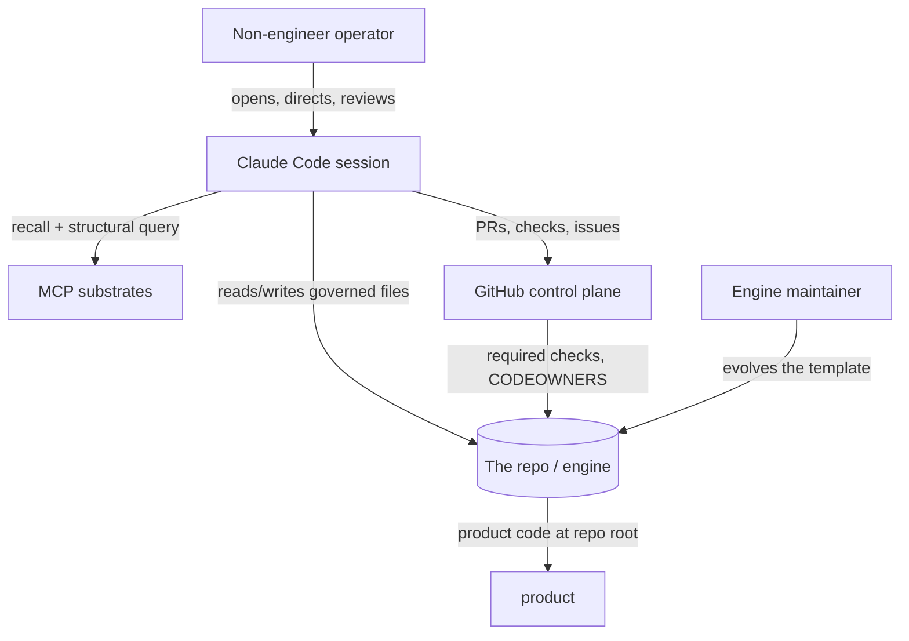
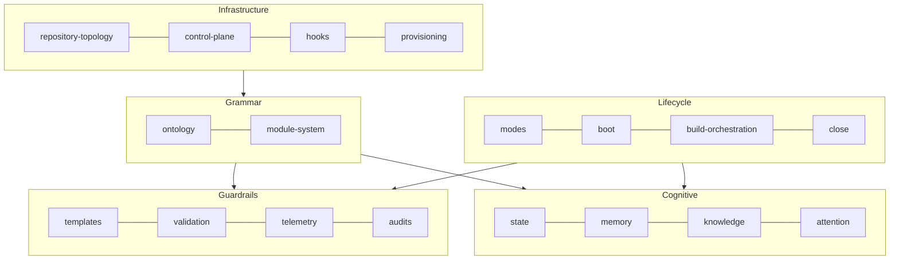
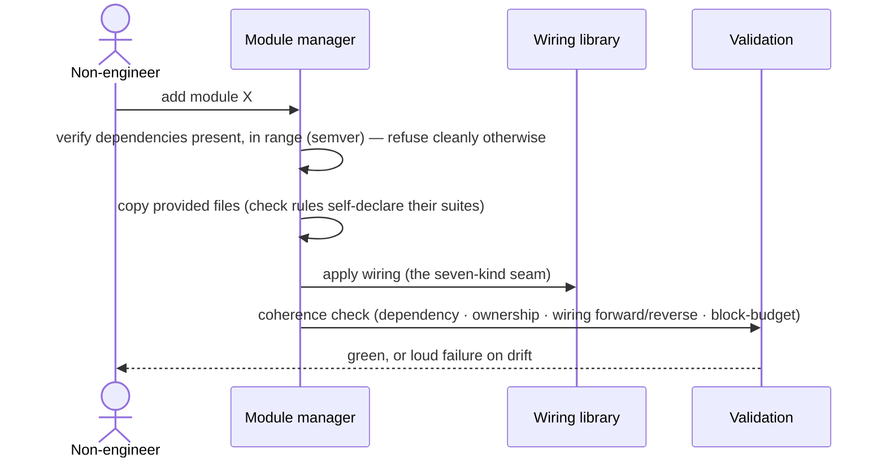
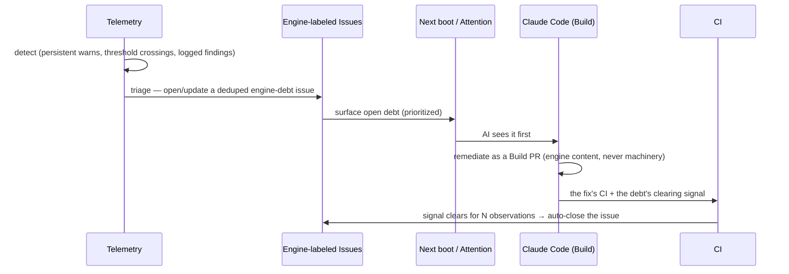

# Architecture

*Reconciled with engine-template@`cdbbc33` as built (2026-08-02) — AI-compared and operator-ruled under [decision 0320](adr/0320-reconcile-the-spec-to-engine-template-as-built-sync-policy.md); the runtime walkthroughs carry the rulings recorded in decisions [0321](adr/0321-adopt-the-build-s-refusal-of-fabricated-cost-and-time-estima.md), [0322](adr/0322-ratify-set-routine-as-the-routine-entry-actor.md), [0327](adr/0327-route-product-spec-authoring-through-plan-acceptance-into-b.md), and [0330](adr/0330-adopt-the-built-semantic-recall-seat-and-the-canon-s-revised.md). Still **in progress** — reconciled is not settled, and this document describes the build as observed, not ratified guarantees. Until the [product spec index](spec/index.md) retires the corpus drift caveat, links out of this document may reach documents still describing intended design.*

This is the master document. It describes the complete end-state of engine-template v1 and links
every system, scenario, and module that realizes it. Read `goals-and-quality.md` for the rubric
this design is judged against, `constraints.md` for the hard limits it respects, and `principles.md`
for the cross-cutting rules that resolve its trade-offs.

## Overview and context

### What the engine is and why

A **GitHub repository template** that, when used to generate a new repo, ships a fully operative,
AI-driven **Engine**: the apparatus a cold-booting Claude Code session needs to start work on any
project and earn the trust of a capable operator who builds through it rather than by reading code — the burden of proof on the engine, not the reader.

A human engineer carries state, memory, knowledge, and attention in their head, and applies
judgment, guardrails, and review habits learned over years. Claude Code starts every session with
an empty context window. The engine's purpose is to **externalize that entire substrate into the
repository** so continuity, quality, and reversibility survive across many stateless sessions.

### Stakeholders and actors

```mermaid
graph TD
    NE[Non-engineer operator] -->|opens, directs, reviews| CC[Claude Code session]
    CC -->|reads/writes governed files| REPO[(The repo / engine)]
    CC -->|recall + structural query| MCP[MCP substrates]
    CC -->|PRs, checks, issues| GH[GitHub control plane]
    GH -->|required checks, CODEOWNERS| REPO
    REPO -->|product code at repo root| PROD[product]
    MAINT[Engine maintainer] -->|evolves the template| REPO
```

- **Non-engineer operator** — generates the repo, directs the work, approves merges. A capable adult who builds through the engine rather than by reading code; not assumed to debug Python or GitHub internals, so the engine must earn trust on evidence they can weigh.
- **Claude Code** — the autonomous builder. Boots cold; consumes the engine; produces product and engine changes under governance.
- **GitHub** — the outer control plane: reviews, required checks, branch protection, history.
- **MCP substrates** — out-of-repo query services over in-repo authoritative data.
- **Engine maintainer** (us) — evolves the template itself.

### Distribution model

The engine is consumed via GitHub's **"Use this template"** (generate a repo = copy the tree as a
single initial commit), **not** `git clone`. The consequences are load-bearing:

- Every **committed file** ships automatically — all of `.engine/`, `.claude/`, workflows, CODEOWNERS, PR/issue templates, docs, and the substrate *code* — the Claude adapter's committed surfaces (`.claude/`, root `CLAUDE.md`, root `.mcp.json`) and the Codex adapter's (root `AGENTS.md`, `.codex/`, `.agents/skills/`) alike, so both runtimes travel together (eADR-0034's split).
- **Gitignored data and derivatives** correctly do not travel — a generated repo starts with empty experiential memory, a freshly derivable knowledge index, and an unmaterialized [tool-runtime](spec/systems/infrastructure/repository-topology.md) (`.engine/.venv/`, which `provisioning` re-materializes from the committed `.engine/pyproject.toml` + `.engine/uv.lock` that *do* ship — the same shape as the derivable knowledge index).
- Only true repo **settings** (branch protection / rulesets, native secret/code scanning, private vulnerability reporting, secrets) do not travel; they require a one-time bootstrap that enables them where the repo's tier supports them and discloses the gap where it does not (see [control-plane](spec/systems/infrastructure/control-plane.md) and [provisioning](spec/systems/infrastructure/provisioning.md)).

Design corollary: **anything that can be a committed file should be** (see `principles.md`), and the
engine confines itself to namespaced paths so the product owns the repo root — the partition and the
laws that govern it are the [repository topology](spec/systems/infrastructure/repository-topology.md).
Two committed files that ship but must not *stay* as shipped are the root `README.md` and the root `LICENSE`:
the README travels as the template's engine-marketing landing front, which [provisioning](spec/systems/infrastructure/provisioning.md)
replaces with a product-owned starter — the writer of the project-README required-spine disclosure — at
first-run instantiation; the LICENSE travels carrying the *template author's* copyright, which provisioning
**clears** at first run (seeding no replacement — the license is the adopter's legal choice), so a generated
repo's product never inherits a foreign copyright. The product thereafter owns the root the engine only
*reconciled* ([topology](spec/systems/infrastructure/repository-topology.md) law 2, [D-213](adr/0213-authorize-the-human-facing-front-door-re-litigation-the-root.md), [D-221](adr/0221-authorize-the-first-run-license-clear-re-litigation-reconcil.md)).

A generated repo is also **detached** — there is no upstream remote — so engine improvements do not
arrive by `git pull`. The whole engine is **versioned packages** (foundations are `required` packages),
and [provisioning](spec/systems/infrastructure/provisioning.md)'s permanent module manager doubles as
the **engine updater**: on request it pulls a tagged engine release from the template's GitHub releases,
overlays only the engine-namespaced paths of the installed packages (preserving operator config — now
including any per-project [policy-override](spec/systems/surfaces/policies.md) of tunable policy values
([D-167](adr/0167-take-up-q17-component-a-authorize-a-five-foundation-re-litig.md)) — and gitignored data, and never resurrecting a deselected module), runs
migrations, and lands a reviewed pull request. Core and features upgrade by one mechanism.

Because the engine is a **contributor** that must be able to join an existing product (§13), the same
overlay machinery also installs the engine onto a **live, populated repo** — the *brownfield* delivery
path. "Use this template" cannot target an existing repo, so brownfield overlays the engine's namespaced
files onto the product tree and runs the same instantiator; coexistence is carried by confining the engine
to its namespaced corners and by keyed, additive edits to platform-shared paths, with file-precise
CODEOWNERS ownership so a product's own content in a shared path is never seized. See [provisioning](spec/systems/infrastructure/provisioning.md).

A third arrangement, **external contribution**, carries the engine as a *contributor to a product repo the
operator does not own* (an open-source project, or the engine-mechanic building this template). The operator
forks the upstream, the engine is brownfield-installed into the fork, and product changes reach the un-owned
upstream as a product-only **cross-fork pull request** gated by the upstream's *own* review. It reuses this
delivery and topology machinery — adding only a §6 upstream-clean nudge and a split trust model — rather than
new grammar; see [external-contribution](spec/systems/lifecycle/external-contribution.md). Its locked-doc seams are
landed ([D-104](adr/0104-phase-c-cross-reference-the-external-contribution-mode-into.md)): additive cross-references in provisioning / control-plane / topology, plus the
substantive close-model change in build-orchestration (the merge wall moves to the upstream).

## The main parts

### The eleven foundations (required from layer one)

These cannot be bolted on later without a refactor; they are present from layer one, delivered as
`required` packages — most riding `core`'s provides, with the memory and validation foundations as their
own required modules (`memory-substrate-sqlite-fts5`, `validators-core`). Everything else is a module on
top — including two required *non-foundation* modules that ship in every repo but are deliberately not
counted among the foundations ([D-067](adr/0067-operator-facing-module-packaging-industry-discipline-categor.md)): the routine stance
(`routine-mode`) and self-checkups (`audit-library`, which delivers the
[audits](spec/systems/guardrails/audits.md) guardrail rung). This is a microkernel-*inspired* shape — a small trusted core plus optional
extensions — but the containment that keeps one extension's failure from spreading is earned by the
wiring discipline at the shared seams, not granted by the shape (see [principles §12](principles.md));
the core stays minimal precisely because a defect in it reaches every generated project.

| Foundation | Answers | Doc |
|---|---|---|
| Topology | what lives where | [infrastructure/repository-topology](spec/systems/infrastructure/repository-topology.md) |
| State | where am I | [cognitive/state](spec/systems/cognitive/state.md) |
| Memory | how did I get here | [cognitive/memory](spec/systems/cognitive/memory.md) |
| Knowledge | how does this world work | [cognitive/knowledge](spec/systems/cognitive/knowledge.md) |
| Attention | what do I focus on, at what level | [cognitive/attention](spec/systems/cognitive/attention.md) |
| Templates | guardrails on what gets written | [guardrails/templates](spec/systems/guardrails/templates.md) |
| Validation | what is written matches expectation | [guardrails/validation](spec/systems/guardrails/validation.md) |
| Telemetry | health, surfaced for remediation | [guardrails/telemetry](spec/systems/guardrails/telemetry.md) |
| Control plane | enforcement that the human can trust | [infrastructure/control-plane](spec/systems/infrastructure/control-plane.md) |
| Hooks | what fires in-session, and what may block | [infrastructure/hooks](spec/systems/infrastructure/hooks.md) |
| Provisioning | stand up, then install/update modules | [infrastructure/provisioning](spec/systems/infrastructure/provisioning.md) |

Two of these carry the heaviest design corrections from the prototype review: **telemetry** is a
*detect → triage → surface → AI-remediate → validate* loop, not an autonomous daemon — and it owns the
**integration-debt register** — tracked as engine-labeled GitHub issues, not a committed file (knowledge no longer carries debt); and **attention** is a
first-class concern expressed as a governed *policy* plus a deterministic ranking *function* (budgeted
allocation + work prioritization), not emergent constants. The cognitive substrate is consulted by a
**push**: an orientation family (cold-start boot pack, a per-prompt scent, post-compaction re-orient)
puts relevant recall in front of the model rather than waiting to be asked.

**Lineage and novelty (maintainer framing).** The cognitive substrate introduces no novel taxonomy — its
shape follows the **CoALA** cognitive-architecture (working / episodic / semantic memory plus a
decision-making procedure), its prioritization is **context engineering**, and its push is **active /
forward-looking retrieval**. The genuine contributions are two: (a) the repo-native **delivery + trust
model** — committed-files, degradable, GitHub-template, non-engineer-operated — which the SDK/research
field is not addressing; and (b) specific **integration choices** that depart from the cited patterns:
the push-not-pull scent ([D-029](adr/0029-cognitive-substrate-is-one-workflow-a-2-store-1-register-1-c.md)) and observe-don't-predict, usage-derived salience
([D-030](adr/0030-memory-ledger-canonical-observe-don-t-predict-capture-lexica.md)). This lineage vocabulary is maintainer-layer framing only — like
"microkernel-inspired" ([D-025](adr/0025-fault-containment-is-earned-at-the-seams-not-conferred-by-mo.md)) it must never surface in operator-facing surfaces or
runtime narration. See `risks.md` and the relevant system docs.

### The governance grammar

The engine does not let a cold AI invent structure on the fly. Two systems define the grammar:

- **[Ontology](spec/systems/grammar/ontology.md)** — the meta-contract and authoring-grammar spine. It names every surface in a single schema-governed catalog and fixes the laws that shape everything authored: amend-first, the four-tier authority order, the three orthogonal axes (authority, enforcement, escalation), and the two lifecycle vocabularies. Surfaces attach to the catalog additively; the laws stay fixed.
- **[Module system](spec/systems/grammar/module-system.md)** — the composability layer: a manifest grammar where every artifact declares the files it *provides* and the *wiring* it requires (hook registration, MCP servers, ontology entries, permissions, gitignore lines, and the Codex runtime's hook/MCP siblings — a closed seven-kind seam vocabulary), plus a semver dependency graph. Check-suite membership is *not* wiring — it is derived from the check files a module provides. This is what lets a module install mechanically instead of by surgery.

### Building-block view

```mermaid
graph TB
    subgraph Grammar
        ONT[ontology] --- MOD[module-system]
    end
    subgraph Cognitive
        ST[state] --- MEM[memory] --- KN[knowledge] --- AT[attention]
    end
    subgraph Guardrails
        TM[templates] --- VAL[validation] --- TEL[telemetry] --- AUD[audits]
    end
    subgraph Infrastructure
        TOP[repository-topology] --- CP[control-plane] --- HOOK[hooks] --- PROV[provisioning]
    end
    subgraph Lifecycle
        MODE[modes] --- BOOT[boot] --- ORCH[build-orchestration] --- CLOSE[close]
    end
    Grammar --> Guardrails
    Grammar --> Cognitive
    Lifecycle --> Cognitive
    Lifecycle --> Guardrails
    Infrastructure --> Grammar
```

Every system has a detail doc:

- **Grammar:** [ontology](spec/systems/grammar/ontology.md) · [module-system](spec/systems/grammar/module-system.md)
- **Cognitive:** [state](spec/systems/cognitive/state.md) · [memory](spec/systems/cognitive/memory.md) · [knowledge](spec/systems/cognitive/knowledge.md) · [attention](spec/systems/cognitive/attention.md)
- **Guardrails:** [templates](spec/systems/guardrails/templates.md) · [validation](spec/systems/guardrails/validation.md) · [telemetry](spec/systems/guardrails/telemetry.md) · [audits](spec/systems/guardrails/audits.md)
- **Infrastructure:** [repository-topology](spec/systems/infrastructure/repository-topology.md) · [control-plane](spec/systems/infrastructure/control-plane.md) · [hooks](spec/systems/infrastructure/hooks.md) · [provisioning](spec/systems/infrastructure/provisioning.md)
- **Lifecycle:** [modes](spec/systems/lifecycle/modes.md) · [boot](spec/systems/lifecycle/boot.md) · [build-orchestration](spec/systems/lifecycle/build-orchestration.md) · [close](spec/systems/lifecycle/close.md) · [external-contribution](spec/systems/lifecycle/external-contribution.md)
- **Surfaces** (the file-type catalog): [contracts](spec/systems/surfaces/contracts.md) · [policies](spec/systems/surfaces/policies.md) · [conduct](spec/systems/surfaces/conduct.md) · [check](spec/systems/surfaces/check.md) · [operations](spec/systems/surfaces/operations.md) · [tools](spec/systems/surfaces/tools.md) · [skills](spec/systems/surfaces/skills.md) · [agents](spec/systems/surfaces/agents.md) · [schemas](spec/systems/surfaces/schemas.md) · [interfaces](spec/systems/surfaces/interfaces.md) · [docs](spec/systems/surfaces/docs.md)

The [contracts](spec/systems/surfaces/contracts.md) surface ships **non-empty** — a bounded foundational eADR canon recording the Engine's own structural-law *why* (engine-owned, overlaid on upgrade), distinct from the per-instance stream a deployment accumulates ([§18](principles.md), [D-169](adr/0169-add-the-foundational-eadr-canon-the-engine-ships-its-own-why.md)).

The [conduct](spec/systems/surfaces/conduct.md) surface likewise ships **non-empty** — universal-good *codes of conduct* (the operator's standing behavioral stance) shipped in `core` and overlaid on upgrade, beneath a per-deployment operator override that is preserved across overlay and seeded so the operator's stance travels to every generated repo. It is loaded at the grounding floor via the root `CLAUDE.md` `@import`, posture-tier and subordinate to every law — the deployed-Engine home for a standing collaboration stance ([D-192](adr/0192-authorize-the-conduct-surface-codes-of-conduct-a-tier-3-pros.md)).

### Modules and the build order

The composable capability bundles — **thirteen at the pin** — with their wiring, dependencies, and status
are catalogued in the [module catalog](reference/module-catalog.md). Because modules declare a semver
dependency graph, the construction sequence was the **topological sort of that graph**, authored in the
retired planning workspace's module build-order (which followed the hand-built
stage-0 harness). A single milestone turned the sort into a plan: **M1, the
self-construction crossover** ([D-101](adr/0101-pin-the-stage-0-self-construction-threshold-to-a-concrete-mo.md), [D-107](adr/0107-author-the-wbs-module-build-order-the-builder-crossover-reso.md)) — the point at which the
partially-built engine (topology + `core` + `validators-core` + the memory floor + the control-plane
bootstrap) takes over its own construction. The nascent engine builds the rest of v1 **in-repo**; the
separate [engine-mechanic](spec/systems/lifecycle/external-contribution.md) build locus stands up
**post-v1**.

Among these, three modules complete the **design → build → QA axis** that brackets the build orchestration:
[product-design](spec/modules/product-design.md) is the operator's intent-to-spec front door and the
producer of the acceptance-criteria referent, and the [design-review](spec/modules/design-review.md) and
[qa-review](spec/modules/qa-review.md) suites fill the orchestration's plan-review and pre-submission
review gates with the v1 lens roster. Against a `locked` `docs/spec/` the axis carries the
[conformance-enforcement floor](reference/glossary.md) — the [spec-obligation matrix](reference/glossary.md) coverage
denominator, qa-review's paired `spec-conformance` (systematic) and `divergence-hunter` (adversarial)
judgment, and the deployed-environment demonstration harness — the same rigor build-conformance runs on the engine self-build, pointed
at the product's own spec (a disclosed no-op where nothing is locked). That floor runs at two cadences over the
one matrix: build-orchestration's per-merge gate, and a **standing, report-only re-sweep on the
[audits](spec/systems/guardrails/audits.md) cron** ([D-296](adr/0296-litigate-engine-template-427-residual-three-l1-l2-l3-audits.md)) that catches conformance drift
after merge — so the guardrail rung, not only the design→build→QA axis, carries the floor's standing half.

The optional-module roster is resolved ([D-068](adr/0068-q1-resolved-the-v1-optional-module-roster-4-cut-2-kept.md)): four prototype bundles were cut and two
kept as `optional` Software Configuration Management modules (`dependency-discipline`, `migration-discipline`),
joined in the built set by `external-contribution`, `github-projects-sync`, and the `default-on`
find-by-meaning layer `memory-semantic-recall`.
The operator-facing **packaging model** ([D-067](adr/0067-operator-facing-module-packaging-industry-discipline-categor.md)) presents only the declinable
packages — the seven opt-out-able optionals plus the one `default-on` module, an eight-entry menu — grouped
under three recognized SDLC discipline categories: **Product Management, Software
Configuration Management, Verification & Validation**; the required spine (the core packages, plus the
routine stance and self-checkups) is never an install choice and is disclosed in the project README.

## How it behaves at runtime

Each flow below was carried from the design workspace's own runtime walkthroughs and is reconciled to
the build as ruled.

### Operating modes

Three enforced stances, with Explore as the grounded boot default — see [modes](spec/systems/lifecycle/modes.md):

- **Explore** (default) — interactive; reads, reasons, logs Issues. Engine/product writes and PR creation are gated off by a `PreToolUse` block (a strong local default, not an absolute wall).
- **Build** — interactive, accountable work as the [build orchestration](spec/systems/lifecycle/build-orchestration.md): a draft PR is the claim; close = the PR submitted for human review.
- **Routine** — unattended, scope-locked execution of a build's implement phase, fired by a scheduled automation on either runtime (a Claude Desktop routine, or a Codex Automation).

Every session boots grounded ([boot](spec/systems/lifecycle/boot.md) runs at every session start over a hook-independent `CLAUDE.md` floor) and in Explore; leaving Explore is a deliberate human act.

Within Explore, the Engine also recommends Claude Code's **native plan mode** as a safe interactive first-touch — a *separate axis* from the stance, written at provisioning as operator config that **yields** to an operator who already prefers a different mode and is changed later via native `/config`. It is ergonomics layered over the Explore gate (never the guarantee), and Routine overrides it with a non-interactive launch posture ([modes](spec/systems/lifecycle/modes.md), [D-185](adr/0185-authorize-a-two-foundation-re-litigation-ship-a-native-plan.md)).

### First-run provisioning

A non-engineer generates a repo from the template and stands it up.

```mermaid
sequenceDiagram
    actor NE as Non-engineer
    participant GH as GitHub
    participant INST as Instantiator
    participant CP as Control plane
    NE->>GH: Use this template → new repo
    NE->>INST: run first-run setup
    Note over INST: GATHER — derive identity tokens; prompt the tier; present module selection
    NE->>INST: confirm selection
    Note over INST: confirm states in plain language: unselected modules are not installed (code removed),<br/>and re-adding one later is a separate request, not a toggle
    Note over INST: writes engine manifest (the resumability checkpoint)
    Note over INST: APPLY (idempotent) — delete unselected; render tokens + CODEOWNERS block
    INST->>NE: native plan-mode default — adopt plan as this repo's safe first-touch<br/>(or keep your existing mode if you already have one); reads ~/.claude read-only, writes only this repo
    INST->>NE: tool-runtime bootstrap — consent to set up the engine's private tool runtime<br/>(your own Python is never touched); NE approves
    Note over INST: uv sync materializes .engine/.venv/ (group-scoped) before any engine Python runs
    Note over INST: init substrates (empty memory, derive knowledge); register MCP; seed state
    Note over INST: seed conduct codes-of-conduct (operator override) from the template's carried seed
    Note over INST: seed root SECURITY.md (operator-owned disclosure file) from the template seed, if absent
    Note over INST: seed root README — replace the engine's marketing landing front with a product-owned starter (greenfield); preserve an existing product README
    Note over INST: clear root LICENSE — delete the template's own traveled license (greenfield) so the product doesn't inherit the author's copyright; seed no replacement; preserve a product's own
    INST->>CP: bootstrap (operator's repo-admin gh; NE approves a grant only if absent) —<br/>apply/augment branch ruleset + enable native scanning where the tier supports it (secrets, code/CodeQL, PVR)
    INST-->>NE: disclose what's now on (incl. PVR: outsiders can now privately report) and, on a free private repo,<br/>what isn't (code scanning, PVR) + how to unlock it; if protection deferred/ungettable, guard fails loud + "gate is off" banner
    INST->>INST: verify (coherence); install the explore write-gate hook; self-delete
    NE->>GH: open Claude Code → first session
```

- The [instantiator](spec/systems/infrastructure/provisioning.md) is a thin, self-deleting first-run orchestrator; its wiring logic and the permanent bootstrap operation live in the shared `.engine/tools/` library it shares with the module manager. Its **presence** is the "unprovisioned" signal — an interrupted run is re-entered, re-offering everything before **confirm** and resuming idempotently after.
- The [control-plane](spec/systems/infrastructure/control-plane.md) bootstrap is the critical, must-not-skip step. The operator's own `gh` applies the ruleset, engine-orchestrated, **using the `repo` capability it usually already holds** — only when that capability is absent does the operator approve a scope grant first (the engine cannot self-grant it); a plain-language explanation precedes any approval screen, and on the common no-grant path the engine confirms in plain language that the review gate is now on. Bootstrap is *attempted* here but defer is the common path — the instantiator retires regardless, and the committed guard + boot nag keep an unprotected repo loudly visible. Full closure of Risk [R1](reference/risks.md) depends on this first-run experience.
- **Provisioning runs ungated:** the explore write-gate is itself a hook the apply phase installs, so the instantiator operates before the engine's own local guardrails exist — the setup→operation boundary is gate-installation-at-retirement, bounded by **resumability and reviewability** (interrupted runs re-enter idempotently from the manifest checkpoint; on brownfield, changes to a live tree are surfaced and reviewable before they land), not merely by the operator's presence and the absence of a protected branch.
- **A hard coherence finding at verify pauses the apply phase** — the engine never proceeds on inconsistent wiring — surfacing in plain language what is inconsistent and a concrete retry-or-abort choice; the manifest checkpoint makes the pause resumable so neither choice loses the operator's selections.
- **Brownfield arrival:** on a live product repo there is no "Use this template" step — the engine overlay-installs its namespaced files onto the existing tree, then runs the same instantiator (with a collision check that surfaces, never overwrites, pre-existing content in shared paths). Identity is derived from the existing remote; team tier is recommended if a team is detected.
- After setup the substrates are empty by design; [memory](spec/systems/cognitive/memory.md) accumulates over time, [knowledge](spec/systems/cognitive/knowledge.md) derives from committed sources.
- **Native plan-mode default:** during APPLY the instantiator reads the operator's existing Claude Code permission mode (**read-only** — it never touches `~/.claude`) and sets this repo's native default to **plan** — a safe first-touch where the engine proposes before it changes anything. If the operator already prefers a different mode it **offers** adopt-or-keep and **honors a decline** (writing nothing, so their own setting governs); the choice is committed operator config, preserved across upgrades and changed anytime via `/config`. It is ergonomics over the Explore stance, not a new guarantee, and a Routine run overrides it ([modes](spec/systems/lifecycle/modes.md), [provisioning](spec/systems/infrastructure/provisioning.md), [D-185](adr/0185-authorize-a-two-foundation-re-litigation-ship-a-native-plan.md)).
- **Codes of conduct seed:** during APPLY the instantiator copies the template's carried *codes-of-conduct* seed into this repo's committed operator-override (`.engine/conduct/operator.md`), so the maintainer's standing behavioral stance rides every generated repo without re-teaching; the universal-default codes of conduct ship in `core` and load at the grounding floor via the root `CLAUDE.md` `@import`. The override is operator config — preserved across upgrades, tunable via the conduct-authoring verb — and an absent seed simply yields an empty override. The seed is **disclosed** to the operator in plain language (the stance is present and yours to tune), never silently installed. It is posture, subordinate to every law ([conduct](spec/systems/surfaces/conduct.md), [provisioning](spec/systems/infrastructure/provisioning.md), [D-192](adr/0192-authorize-the-conduct-surface-codes-of-conduct-a-tier-3-pros.md)).
- **Security floor — code scanning, disclosure, and the free-private drawback:** the [security floor](reference/glossary.md) enables the **native** GitHub security features where the repo's tier supports them — at the bootstrap (the operator-privileged `gh` already in hand) it turns on **CodeQL code scanning** and **private vulnerability reporting** alongside secret scanning. On the common **free private** repo, code scanning is unavailable and PVR does not exist for private visibility, so the engine ships **no bespoke scanner** there and instead **discloses the drawback in plain language** — what's off and what would unlock it (make the repo public, or add the paid tier) — and **never auto-switches visibility**. A **root `SECURITY.md`** is seeded as operator-owned config (preserved across upgrades, collision-checked on brownfield so a product's own is never overwritten), so every repo carries a vulnerability-disclosure channel even where native PVR can't exist. Native code-scanning alerts are advisory, never a merge gate — so a finding never blocks the non-engineer ([control-plane](spec/systems/infrastructure/control-plane.md), [provisioning](spec/systems/infrastructure/provisioning.md), Risk [R25](reference/risks.md), [D-212](adr/0212-resolve-the-d-211-security-floor-re-litigation-landed-text-c.md)).
- **Project README seed:** during APPLY the instantiator seeds this repo's **own** root `README.md` — a product-owned starter that introduces *their* project and discloses the always-present required spine in plain language (the writer of the required-spine disclosure). On a greenfield repo generated from the template the root README arrives carrying the Engine's **marketing landing front** (the page that sold the operator on deploying); Apply **recognizes that engine seed and replaces it** with the product starter, so the operator's brand-new repo describes their project, not the Engine. It touches the README **only** where the slot still holds the engine's own marketing seed — a brownfield product's README, or any later operator edits, are preserved untouched, and the engine never re-touches the root README after first run. The seed/replace is **disclosed** in plain language (the engine set your project's README), never silent — the root is the product's thereafter ([topology](spec/systems/infrastructure/repository-topology.md) law 2, [provisioning](spec/systems/infrastructure/provisioning.md), [D-213](adr/0213-authorize-the-human-facing-front-door-re-litigation-the-root.md)).
- **Root LICENSE clear:** the template ships its own `LICENSE` (the maintainer's copyright) so the public template repo is legally usable; "Use this template" copies it to the generated repo's root, where it would govern *their* product. During APPLY the instantiator **clears** that traveled license on greenfield — only where the slot still holds the engine's own template-license seed (a conservative match on the license body **and** the template author's copyright line, evaluated before any identity rendering; preserve on doubt), seeding **no** replacement because the license is the adopter's legal choice. A product's own LICENSE never matches and is untouched (and a brownfield overlay never lands a root LICENSE at all); the engine never re-touches it after first run. The clear is **disclosed** in plain language — factual, never legal advice: what was removed and why, that no replacement was added, that a new project with no license is private-by-default (their code is theirs until they choose to share it), with a pointer to GitHub's `choosealicense.com` and an offer to help *add* the license they pick — never which one to choose ([topology](spec/systems/infrastructure/repository-topology.md) law 2, [provisioning](spec/systems/infrastructure/provisioning.md), [D-221](adr/0221-authorize-the-first-run-license-clear-re-litigation-reconcil.md)).
- **Tool-runtime bootstrap:** before the Python substrate steps, the instantiator ensures the engine's uv-managed tool-runtime exists — installing `uv` PATH-independently behind a plain-language consent gate (a heavier-trust ask than the OAuth scope grant: it affirms *what* is installed, *where* — a private engine folder — *why* (so the engine can run its own tools), and that the operator's own Python is untouched, from a pinned official source) and running `uv sync` to materialize `.engine/.venv/`. If it cannot (offline, a blocked download), the engine surfaces it in plain language with a retry and finishes automatically once reachable — it never falls back to the operator's system Python ([D-156](adr/0156-name-the-engine-s-execution-substrate-a-group-scoped-uv-mana.md), Risk [R18](reference/risks.md)).
- **Degradation path:** if a substrate server is unavailable at the first [boot](spec/systems/lifecycle/boot.md), orientation still renders from committed state.

### Product-design intake

The operator says *what* they want built, and the [product-design](spec/modules/product-design.md)
module turns it into a **committed, structured, validated spec corpus** with acceptance criteria, then
decomposes the `locked` spec into a legible build-plan and ordinary work Issues — the front half of the
design → build → QA axis. The verb opens in Explore — it reads, reasons, elicits, and **proposes**; the
**committed authoring lands in Build, entered through the operator's plan acceptance**
([decision 0327](adr/0327-route-product-spec-authoring-through-plan-acceptance-into-b.md)) — the same
door every other committed write uses ([D-179](adr/0179-augment-interactive-build-entry-with-plan-acceptance-correct.md)'s plan-acceptance entry, with the
Explore write-gate kept whole). Starting an *implementation* build from a work Issue is a later
deliberate act — by the operator-typed verb, or by accepting that build's plan.

```mermaid
sequenceDiagram
    actor NE as Non-engineer
    participant CC as Claude Code (engine-design)
    participant FS as Product tree (docs/spec/)
    participant GH as GitHub (Issues + Milestones)
    NE->>CC: /engine-design "I want to build …"
    CC->>CC: pre-check gh; persist typed intent (nothing lost)
    CC->>NE: propose the stub map — "do these look like the right pieces?"
    CC->>NE: depth choice (short vs full spec), consequence named
    NE->>CC: accept the authoring plan → enters Build (plan acceptance)
    CC->>FS: author spec doc(s) from the scaffold; criteria as a checkable table
    CC->>CC: validation runs (form checks); plain-language readout, its bound stated
    CC->>NE: criteria-quality verdict ("checkable" vs "too vague — what's missing")
    NE->>CC: accept → the spec is locked (settled, don't-churn ground)
    CC->>NE: "your spec lives here; reopen it any time"
    CC->>GH: decompose into a build-plan → un-labeled work Issues under Milestones
    NE->>CC: "build this Issue" → enters Build
```

- **One plain-language front door.** The operator describes intent; the engine attaches the framework
  (arc42 / C4 / ADR / Diátaxis) as an internal label and renders every operator surface in plain language —
  framework and maintainer vocabulary never surface to the operator
  ([operator-communication law](reference/glossary.md), [D-120](adr/0120-lock-core-the-root-module-the-closure-wave-s-terminal-ratifi.md)).
- **The spec is a committed, validated corpus — the confidence surface.** The spec tree (`docs/spec/`,
  `stub → draft → locked`), the arc42 doc, C4 diagrams, the ADR stream (product numbering, never the engine's
  `eADR-####` canon nor a deployment's `<project-slug>-eADR-####` stream),
  and the Diátaxis tree live in the product's own tree; the engine authors them as a
  [contributor](principles.md) and **validates the spec's *form* read-only** (presence/shape/coverage),
  never annexing or governing the product. A structured, validated spec is what a non-engineer can weigh — the
  validator does the checking the operator cannot ([D-244](adr/0244-re-litigate-product-design-into-a-first-class-spec-driven-de.md)).
- **The lock is operator-governed.** The operator's recorded acceptance locks the spec (on validation green
  plus, when installed, the design-review lenses *advising*); the engine never vetoes what the product
  becomes. Only a `locked` spec drives a build, and a locked spec is settled, don't-churn ground with teeth.
- **Issues are pointers; Milestones are the legible map.** The `locked` spec decomposes into a committed
  build-plan and **ordinary un-labeled work Issues** that point at their spec doc; build-orchestration emits
  native **Milestones** so a large build reads as ordered phases, not an issue dump. The spec — not the Issue
  — is the build session's authoritative source ([D-244](adr/0244-re-litigate-product-design-into-a-first-class-spec-driven-de.md)).
- **The spec is the un-skippable referent.** Its acceptance criteria are what the `product-intent`
  (plan-review) and `spec-conformance` (pre-submission) lenses check against ([D-066](adr/0066-the-4-4-review-lens-roster-two-stage-suites-mirroring-the-en.md)); a
  build with no `locked` spec makes those a disclosed no-op, never a silent green; the spec is kept
  un-skippable by a mechanical coverage check plus `spec-conformance` posture at the merge.
- **Degradable & proportionate.** Every step lands as committed files or native Issues; a substrate/board
  outage degrades to `gh`-only and is disclosed ([fail-open-and-flag](reference/glossary.md)). Rigor is uniform,
  ceremony scales — a small spec locks light, and a trivial change can skip the front door entirely (the two
  lenses then disclose a no-op). (See [product-design](spec/modules/product-design.md),
  [D-244](adr/0244-re-litigate-product-design-into-a-first-class-spec-driven-de.md).)

### Build session lifecycle

The operator asks for a change and the AI builds it accountably as the
[build orchestration](spec/systems/lifecycle/build-orchestration.md).

```mermaid
sequenceDiagram
    actor NE as Non-engineer
    participant CC as Claude Code (orchestrator)
    participant SUB as Cold-context subagents
    participant GH as GitHub
    NE->>CC: "build this"
    CC->>CC: boot pack (grounded); leave Explore
    CC->>GH: open draft PR (the claim) + plan the commit sequence (written to the build Issue where the work warrants it)
    CC->>NE: risk assessment + suggested depth → approve plan & depth
    CC->>SUB: plan-review lenses, at the approved depth, before any implementation
    SUB-->>CC: findings → synthesize one call; re-engage NE if material (always if blocking)
    CC->>CC: implement (workers generate; orchestrator reviews, revises, authors the cohesive set)
    CC->>CC: confirm green validation baseline
    CC->>SUB: pre-submission lenses (gated behind the green baseline)
    CC->>GH: fill the PR contract incl. the Review record → submit for review
    NE->>GH: review + merge (the unbypassable gate)
```

- **Two ways into Build.** The diagram shows a direct *"build this"* (the operator-typed verb). The
  other interactive entry is **accepting a plan**: when the operator approves a plan, that acceptance
  enters Build — no extra verb — and the same announced kickoff (draft PR + plan) follows
  ([modes](spec/systems/lifecycle/modes.md), [D-179](adr/0179-augment-interactive-build-entry-with-plan-acceptance-correct.md)); a rejected plan stays in
  Explore.
- **Two surfaces:** the **draft PR is the claim** (the change surface); the **build Issue** is the
  forward plan's home where one is written — the checklist is **proportionate** (required for
  routine-distributed work, offered for an interactive multi-commit build, otherwise held in-session,
  and skipped on the fast path) — and there is no separate claim artifact,
  slot, or active-session record. Findings from each gate are dispositioned (fix / log an Issue /
  escalate) before advancing ([policies](spec/systems/surfaces/policies.md)).
- **The plan gate is two beats:** a risk-assessment **consent before the spend** (a plain-language
  headline + what will run + a consequence-named depth choice, operator-gated — **never a cost or time
  figure**, which the engine cannot know; [decision 0321](adr/0321-adopt-the-build-s-refusal-of-fabricated-cost-and-time-estima.md)), then the lenses run
  and the orchestrator **synthesizes** their findings into one recommended call **after** — re-engaging
  the operator on material findings and *always* on an unresolved blocking finding. A trivial change
  collapses to the [fast path](spec/systems/lifecycle/build-orchestration.md) (no checklist, no
  lenses, a single headline-confirm).
- **Workers buy cohesion, not speed.** Each worker generates one commit's scope in an isolated
  worktree and returns *work product*; the orchestrator is the **single writer** — it reviews, revises,
  and authors the cohesive set, so the PR reaching the cold audits is free of assembly noise. As the final
  authoring step it reconciles the base and **regenerates the [§19](principles.md) derived-committed
  artifacts** (the knowledge graph, the self-map) from the reconciled tree, so a concurrent-PR conflict on them
  is auto-resolved by regeneration — never a hand-merge, never surfaced to the operator
  ([build-orchestration](spec/systems/lifecycle/build-orchestration.md)).
- **Validate before the expensive review.** A green mechanical baseline is the precondition to the
  pre-submission lenses; validation reruns on every change, but the cold audits run once at the agreed
  depth and do not blanket-rerun on fixes — the orchestrator measures the post-review divergence and
  makes a **proportional re-audit judgment**, re-invoking the passes that fit the repair, scoped to the
  post-review diff, when warranted (the Review record states that delta).
- **The lens roster is the design → build → QA axis.** Each gate runs its v1 lens suite
  ([design-review](spec/modules/design-review.md) quartet / [qa-review](spec/modules/qa-review.md) quintet);
  when the building Issue carries a [product-design](spec/modules/product-design.md) spec, the
  `product-intent` and `spec-conformance` lenses check its acceptance criteria. A spec-less build makes
  those two a disclosed no-op.
- **Close = the PR submitted for human review.** The PR contract's **Review** section records what
  review the change received and surfaces the change's operator-runnable acceptance steps — or a plain
  reason-named line when there is nothing the operator can run (presence-gated; truthfulness posture). The per-turn `Stop` does only
  ambient memory capture and the finding-disposition gate ([close](spec/systems/lifecycle/close.md));
  there is no close ritual.
- Local [validation](spec/systems/guardrails/validation.md) and review nudge; the unbypassable
  gate is the protected-branch merge ([control-plane](spec/systems/infrastructure/control-plane.md),
  [principles §6](principles.md)).

### Routine session

An unattended, scope-locked scheduled run that advances a batch of **decomposable bulk work** (e.g.
populating a store with thousands of nodes) while the operator is away — the time-distributed
[implement phase](spec/systems/lifecycle/build-orchestration.md) of a build whose PR an
interactive Plan session opened and an interactive Finalize session will close. Decomposability is a
Plan-time judgment; tightly-coupled work stays in interactive Build.

```mermaid
sequenceDiagram
    participant SCH as Scheduled automation (Desktop routine or Codex Automation)
    participant CC as AI session (non-interactive)
    participant GH as GitHub (open PR + build Issue)
    SCH->>CC: fire — Instructions invoke the routine command (/engine-routine or $engine-routine)
    CC->>GH: boot; read git + the build Issue checklist — next planned chunk + its scope?
    alt nothing eligible
        CC-->>SCH: exit cleanly ("nothing to do")
    else work present
        CC->>CC: execute the next chunk within the scope-lock
        CC->>GH: add commit(s) to the open PR; report "N of M done"
        opt needs a human
            CC->>GH: open an Issue + halt this task (cannot ask; names the next step)
        end
    end
```

- **Entry is the routine command** — `/engine-routine` on Claude Code, or its generated Codex mirror
  `$engine-routine` (carrying the same no-self-invocation flag) — the operator embeds the engine-prefixed
  command in the automation's Instructions; firing invokes it via the command-parser path (not model
  self-election), entering the routine procedure. A **misfire is operator-visible**: a fire that finds no valid target where one
  was expected leaves a durable Issue (not a silent exit), and the routine echoes the build Issue it
  locked onto on its first fire — so a forgotten command or mis-aimed target surfaces rather than idling.
- The scheduling substrate is **operator-owned on either runtime**: a **Local Desktop routine**
  (explicitly *not* the cloud Routines product — subscription-billed, the operator's own git identity per
  the solo [identity model](spec/systems/infrastructure/control-plane.md), the machine kept awake, since a
  Desktop routine does not fire while the machine sleeps) or a **Codex Automation**. The operator
  configures and starts it; an AI session cannot stand one up alone. Because a scheduled
  run does **not** auto-isolate into a worktree by default, the routine setup has the operator
  enable the per-task **worktree toggle** so each run isolates from the operator checkout rather than
  committing in it — and the entry itself grants the write stance only on positive proof of worktree
  isolation ([decision 0322](adr/0322-ratify-set-routine-as-the-routine-entry-actor.md),
  [build-orchestration](spec/systems/lifecycle/build-orchestration.md)).
- The **durable plan and the scope-lock both live in the build Issue** — the ordered commit-sequence
  checklist and the planned chunks' permitted write-scope — so a cold routine session reads what to do
  next and what it may touch. This is bounded by GitHub availability (offline ⇒ no plan ⇒ the run does
  not proceed; fail-safe).
- The run is **non-interactive** (pre-approved tools, no prompts) so it genuinely **cannot ask**
  ([constraints](reference/constraints.md), [modes](spec/systems/lifecycle/modes.md)) rather than
  stalling on a permission prompt. An out-of-scope observation is filed as an Issue and the run
  continues; a genuine blocker files an Issue and **halts that task**, leaving a plain-language status
  that names the concrete next step ("answer Issue #N, then re-run the routine").
- **Single-flight** is the **scheduler's skip-a-run-while-one-is-in-progress** behavior *where the
  scheduler provides it* — the Claude Desktop routine does; whether a Codex Automation does is not
  verified from inside the engine, so two overlapping fires are possible there, bounded by the no-merge
  wall and the Finalize review rather than a lease (the local counterpart to the control-plane
  single-flight law for Actions-hosted scheduled work). Routine
  **accumulates commits on one open PR and never closes or merges it**; the interactive Finalize
  session confirms the green baseline, runs pre-submission review, and submits for human review
  ([build orchestration](spec/systems/lifecycle/build-orchestration.md)).
- Orphan recovery is reading git state, not a lease: a run that dies mid-task leaves its commits (or
  none) and the PR open; the next run resumes from git and the checklist.

### Adding a module to a live repo

A capability is installed on an already-running project — the test of composability.

```mermaid
sequenceDiagram
    actor NE as Non-engineer
    participant MM as Module manager
    participant WL as Wiring library
    participant VAL as Validation
    NE->>MM: add module X
    MM->>MM: verify dependencies present, in range (semver) — refuse cleanly otherwise
    MM->>MM: copy provided files (check rules self-declare their suites)
    MM->>WL: apply wiring (the seven-kind seam)
    MM->>VAL: coherence check (dependency · ownership · wiring forward/reverse · block-budget)
    VAL-->>NE: green, or loud failure on drift
```

- This is the failure mode the restart exists to prevent: in the prototype, modules were files + dependencies only, so install side-effects were hand-surgery (Risk [R5](reference/risks.md), [D-012](adr/0012-provisioning-is-two-subsystems-on-one-manifest-grammar-modul.md)).
- The fix: manifests declare [wiring](spec/systems/grammar/module-system.md); the shared library in [provisioning](spec/systems/infrastructure/provisioning.md) applies/reverses it (keyed, idempotent edits to shared files like `.claude/settings.json`); [validation](spec/systems/guardrails/validation.md) confirms coherence. Check-suite membership needs no wiring — a copied [check](spec/systems/surfaces/check.md) rule self-declares its suites, so the roster is derived, not mutated.
- **The ruleset is not touched.** GitHub binds a required check by its stable workflow/job *status name*; the added module's checks flow into the engine CI check via the derived suite roster, changing *what runs inside* it, not the bound name — so ordinary `add` needs no operator-privileged ruleset step. The exceptions are a module shipping its **own** required workflow, [clean removal](spec/systems/grammar/module-system.md) (which deletes the CI workflow → de-bootstrap), and the team-tier upgrade; only then does the module manager bind/unbind, ordered against the PR so the union never requires an absent check.
- **Verbs:** `add`/`remove` are per-module at the current release (`remove` refuses, in plain language, while a present module still depends on it); a *newer* module version arrives only via an engine [upgrade](architecture.md#upgrading-the-engine) — there is no per-module update.
- Same machinery as the [first-run](architecture.md#first-run-provisioning) instantiator, minus the one-time steps.

### Upgrading the engine

An already-generated project pulls a newer Engine — the test of whether improvements reach the field.
A repo made with "Use this template" is detached (no upstream remote), so this is not a `git pull`.

```mermaid
sequenceDiagram
    actor NE as Non-engineer
    participant MM as Module manager (updater)
    participant REL as Template GitHub releases
    participant WL as Wiring library
    participant VAL as Validation
    participant CP as Control plane
    NE->>MM: update engine (latest, or a pinned tag)
    MM->>MM: read engine manifest (current package versions + the home repository — which template to fetch from, never origin)
    MM->>REL: fetch the tagged engine release
    MM->>WL: overlay engine paths — code replaced (incl. pyproject + uv.lock), config + data preserved; apply/reverse wiring deltas
    MM->>MM: re-sync tool-runtime — uv sync rebuilds .engine/.venv/ from the new uv.lock (group-scoped), before migrations run in it
    MM->>MM: snapshot affected gitignored stores, then run migrations current → target, in dependency order
    MM->>VAL: coherence check (dependency · ownership · wiring forward/reverse · block-budget)
    MM->>CP: open a pull request (required checks)
    CP-->>NE: green checks; merge is informed consent
```

- **The whole engine is versioned packages** ([module-system](spec/systems/grammar/module-system.md)): foundations are `required` packages, features the others; all carry `migrations`. So core and features upgrade by one mechanism, driven by the committed **engine manifest**. ([D-024](adr/0024-the-engine-is-upgradeable-versioned-packages-upgraded-by-ove.md).)
- **Only engine-namespaced paths are overlaid** ([repository-topology](spec/systems/infrastructure/repository-topology.md) wall): engine *code* is replaced wholesale; operator-owned engine *config* and gitignored *data* (experiential [memory](spec/systems/cognitive/memory.md)) are preserved; product paths are never touched.
- **The tool-runtime re-syncs between overlay and migrations.** The committed `.engine/pyproject.toml` + `.engine/uv.lock` are engine *code*, replaced wholesale by the overlay; `uv sync` then rebuilds `.engine/.venv/` (group-scoped) from the new lock so the migrations — themselves Python that runs *in* the runtime — execute against the target dependency set. `uv sync` materializes the venv only and **never mutates a gitignored data store**; a dependency bump that would reshape a store rides a normal **backup-first** `migrations` entry (below), keeping the reversibility guarantee intact ([D-156](adr/0156-name-the-engine-s-execution-substrate-a-group-scoped-uv-mana.md), Risk [R18](reference/risks.md)).
- **The update source is the engine's home repository's GitHub releases**, pinned to a tag — never a merge of an upstream branch, which a non-engineer could not resolve. **Which** repository that is resolves from the engine manifest's recorded **home** (the same coordinate the escalate-upstream audit uses), **never the deployed repo's own `origin`** — a detached repo's origin is its own release-less repo. Resolution is three-state: a recorded, resolvable home fetches; a recorded-but-release-less home refuses **loudly, naming the home**; an **absent** home refuses cleanly with a plain-language reason and next step, never a dead end ([provisioning](spec/systems/infrastructure/provisioning.md) *Upgrading the engine*).
- **Reviewed and reversible:** the upgrade lands as a PR through the [control-plane](spec/systems/infrastructure/control-plane.md) gate, like any other change, not an in-place mutation.
- **Degrades:** an unreachable release source leaves the repo on its current version, still working (Risk [R7](reference/risks.md) covers the supply-chain surface — pulling executable engine code is mitigated by tag-pinning, the coherence check, and the human merge).
- **Migration reversibility is backup-first.** Code is replaced wholesale (no migration); only preserved operator config and gitignored data can need reshaping, so each data migration **snapshots before mutating** — to a **distinct retained copy memory's routine backup never overwrites** (the [D-264](adr/0264-authorize-git-native-retention-for-the-pre-migration-memory.md) retained pre-migration snapshot, on memory's backup path), not the overwritable rolling slot. Reverting the PR restores code but not gitignored data, so a **migration-owned version-stamp check** flags a code-reverted-but-data-not-restored mismatch, **surfaced by [boot](spec/systems/lifecycle/boot.md)** (read-only) in plain language with the **exact restore command targeting that retained snapshot** (one plain action, named by a plain handle, never a latest-vs-snapshot fork) — not a buried PR-body note. Detection is the migration's, rendering is boot's existing open-findings path; migration never runs at boot.
- **An operator [policy-override](spec/systems/surfaces/policies.md) is preserved like any operator config** ([D-167](adr/0167-take-up-q17-component-a-authorize-a-five-foundation-re-litig.md)): the overlay never overwrites it. Because it is a *committed* file it reverts with the PR (no backup-first migration), and a value-schema change that strands an override key falls back to the shipped default and is surfaced by [boot](spec/systems/lifecycle/boot.md) — per-key, no reshaping.
- **The seeded `SECURITY.md` is preserved as a product path.** Seeded once at the repo **root** (operator-owned vulnerability-disclosure file, [security floor](reference/glossary.md)), it sits in product territory — so the "product paths are never touched" rule above preserves it on every overlay with **no engine carve-out** needed (unlike the engine-namespaced conduct override). The operator's edits to it survive an upgrade like any product file ([control-plane](spec/systems/infrastructure/control-plane.md), [D-212](adr/0212-resolve-the-d-211-security-floor-re-litigation-landed-text-c.md)).
- **The required-check status name is frozen across versions** — GitHub does not rebind on rename (a renamed job "waits forever"), so a migration may never rename the engine CI check; with the name stable, derived suite rosters change what runs inside it without re-binding.
- Same machinery as the [first-run](architecture.md#first-run-provisioning) instantiator and [add-a-module](architecture.md#adding-a-module-to-a-live-repo), applied to `required` packages as well as optional ones — via [provisioning](spec/systems/infrastructure/provisioning.md)'s permanent module manager.

### The detect to remediate loop

How the Engine improves itself across sessions without an autonomous daemon. This is the honest shape of
"self-healing": self-surfacing plus next-session AI remediation, with the operator's merge as the gate.

```mermaid
sequenceDiagram
    participant TEL as Telemetry
    participant GH as Engine-labeled Issues
    participant BOOT as Next boot / Attention
    participant CC as Claude Code (Build)
    participant VAL as CI
    TEL->>TEL: detect (persistent warns, threshold crossings, logged findings)
    TEL->>GH: triage — open/update a deduped engine-debt issue
    GH->>BOOT: surface open debt (prioritized)
    BOOT->>CC: AI sees it first
    CC->>CC: remediate as a Build PR (engine content, never machinery)
    CC->>VAL: the fix's CI + the debt's clearing signal
    VAL->>GH: signal clears for N observations → auto-close the issue
```

- The only autonomous step is **triage** — telemetry opening or updating a **deduped, engine-labeled
  GitHub issue** when a signal warrants tracking. Detection reports; remediation is the AI's job next
  session. (See [telemetry](spec/systems/guardrails/telemetry.md), [D-009](adr/0009-telemetry-is-a-remediation-loop-not-self-healing.md),
  Risk [R3](reference/risks.md).)
- **The "debt register" is the view over open engine-labeled issues** — not a committed or gitignored
  file. An issue *references* [knowledge](spec/systems/cognitive/knowledge.md) entity-ids for "what
  is broken," while knowledge stays purely surface-derived and carries none of it
  ([D-031](adr/0031-integration-debt-is-a-telemetry-owned-register-not-a-knowled.md)). [State](spec/systems/cognitive/state.md) holds only a count/pointer.
- [Attention](spec/systems/cognitive/attention.md) is what guarantees surfaced debt is seen first.
- The same locked **finding-disposition** "log it" routing receives concerns any session logs, so an "oh
  weird, moving on" never dies in chat — it enters this same loop as an issue.
- **Remediation is ordinary [Build](spec/systems/lifecycle/build-orchestration.md) work:** a draft PR
  is the claim; the fix's CI plus the debt's clearing signal is the validation; the operator's merge is
  the gate. It edits engine **content** (preserved across an engine upgrade), never engine **machinery**
  (template-owned and overlaid) — a machinery bug takes the **escalate** disposition upstream. The
  [audits](spec/systems/guardrails/audits.md) judgment rung feeds the same loop through the same two
  lanes — **local retire/reconcile** for accumulated local cruft, **escalate-upstream** for a machinery bug
  ([D-076](adr/0076-lock-the-audits-system-re-founded-for-the-deployed-repo-hygi.md)).
- **Auto-resolve closes the issue** — for a signal read live from its source, only on a **pass observed
  on that same source**, never mere absence; for a signal accrued from ambient caches, once it has been
  **absent for a set number of observations**; and a source the resolving pass did not observe at all is
  carried forward untouched rather than closed
  ([telemetry](spec/systems/guardrails/telemetry.md)). It retires the flag, it does not repair anything.
- The loop closes across sessions — never claim it heals while the operator sleeps.

### Contributing to an external repo

The Engine builds a feature for an upstream project the operator cannot administer — an open-source
contribution, or the engine-mechanic building engine-template — and submits it as a product-only pull
request. The test of the [§13](principles.md) contributor relationship across a repo boundary.

```mermaid
sequenceDiagram
    actor NE as Non-engineer
    participant ENG as Engine (in the fork)
    participant FORK as Fork (operator-owned)
    participant UP as Upstream (un-owned)
    actor MAINT as Upstream maintainers
    NE->>FORK: fork the upstream; brownfield-install the Engine
    NE->>ENG: contribute feature X to <upstream>
    ENG->>FORK: cut product branch from upstream's default (engine-clean by origin)
    ENG->>FORK: author product-only commits (substrate stays on the engine branch)
    ENG->>ENG: upstream-clean nudge — engine-owned paths in the diff? (§6 local)
    ENG->>UP: open cross-fork PR (upstream ← fork:feature), product paths only
    UP->>MAINT: upstream's OWN required checks + review — the real wall
    MAINT-->>NE: accepted / changes requested / declined (may take weeks)
    Note over NE,FORK: upstream unreachable → work is committed on the fork; the operator owns a working fork
```

- The fork is an **ordinary same-repo deployment** (the Engine is
  [brownfield](spec/systems/infrastructure/provisioning.md)-installed into it): product at the root, the
  Engine in `.engine/`, the full committed cognitive substrate. Cross-repo changes nothing about how the
  Engine works — only *where the merge gate lives* and *that the Engine must not ride the contribution*.
- **The Engine stays off the contribution by posture.** The product branch is engine-clean by origin (cut from
  the upstream's engine-free default); the Engine authors product-only commits onto it from its fork-main
  context, so [knowledge](spec/systems/cognitive/knowledge.md) regeneration never lands there (no
  knowledge change needed). The **§6 upstream-clean nudge** (predicate = the
  [topology](spec/systems/infrastructure/repository-topology.md) file-precise CODEOWNERS engine-owned set)
  catches an accidental engine path before submit, **backstopped by the upstream's own review** — honest
  posture, not a mechanical guarantee.
- **Trust is two gates, named honestly.** The fork's own checks are contributor-side; the wall is the
  **upstream's own review/CI** — a [§6](principles.md) human gate whose human is not the operator (its
  required checks run upstream-side regardless of the fork's settings). An *ungoverned* upstream → the honest
  line ([§7](principles.md)) that the fork-side checks are the only real gate.
- **Submitted ≠ accepted.** The operator-facing narration sets that expectation; DCO/CLA and any rebase or
  conflict degrade to a plain "I need a decision," never raw git ([§12](principles.md) leak guard).
  Degradation ([§5](principles.md)): an unreachable upstream leaves the operator a **working fork**.
- **The engine-mechanic is this scenario with `<upstream>` = engine-template** — the well-governed end (the
  template carries its own [control-plane](spec/systems/infrastructure/control-plane.md) governance) — and
  the building instance never self-upgrades to its own output.
- Reuses the [brownfield](spec/systems/infrastructure/provisioning.md) install, namespaced confinement,
  and file-precise CODEOWNERS; designed in
  [external-contribution](spec/systems/lifecycle/external-contribution.md), packaged as an optional
  [module](spec/modules/external-contribution.md) ([D-102](adr/0102-cross-repo-external-contribution-as-a-first-class-v1-operati.md)).

### Genesis build-conformance

How a single construction PR reaches `main` during the bootstrap build — before the engine's own
machinery governs building — when the **sole human gate is a non-engineer who cannot read code**
([constraints](reference/constraints.md)). The merge is **informed consent on an evidence bundle, never code
review** ([principles §17](principles.md)); this is the runtime shape of that promise.

```mermaid
sequenceDiagram
    actor NE as Non-engineer maintainer
    participant CC as Claude Code (orchestrator)
    participant SUB as Cold-context lenses
    participant GH as GitHub (protected main)
    NE->>CC: build the next step of the construction order (the retired planning workspace's WBS)
    CC->>CC: re-ground from merged disk; plan one small PR
    CC->>GH: open PR; the stage-0 seed validator (superseded at M1) / validators-core runs (mechanical green)
    CC->>SUB: build-conformance review — conformance + adversarial divergence-hunter (cold)
    SUB-->>CC: divergences (structural + semantic)
    CC->>CC: ground-truth each against the code; re-adjudicate a high-confirm lens
    CC->>GH: fix divergences in-line on the branch; re-validate (loop until clean)
    CC->>NE: evidence bundle in plain language + a behavioral recipe + proposed depth
    NE->>GH: run the recipe; vary it; watch the behavior — then merge (informed consent)
```

- **The merge rests on five evidence classes, only two non-AI** (stage-0 §1/§7):
  mechanical green (the deterministic floor), the build-conformance
  review (AI — value from independence + adversarial pressure), **operator-runnable behavioral
  demonstration** (the one class that routes around AI judgment), tests wired *through* the conformance
  review, and the honest [control-plane](spec/systems/infrastructure/control-plane.md) Review
  record. The maintainer never reads code; they weigh evidence and run behavior.
- **The behavioral demo is the maintainer's, not the AI's.** The recipe is one the maintainer runs and
  is coached to *vary* ("try to merge anyway and watch it stop you"), never a pre-baked happy path —
  because a demonstration the AI scripts only shows the AI's chosen path. ([Behavioral attestation](reference/glossary.md) pins its shape and lifecycle.)
- **Build-conformance is the per-PR catch for a *semantic* misread.** Small one-step PRs + re-grounding
  bound *structural* compounding, but a misread that builds and passes its own tests produces a
  well-formed input the next step builds on faithfully — so it is caught **here, at the introducing
  PR, before merge** (build-conformance §3), or not by re-grounding at
  all. Correction is **intra-PR** (revise the branch until clean), not a future session unwinding
  merged work.
- **Tests are never trusted on their names.** A green test name proves nothing to a non-engineer; the
  cold lens attests name↔assertion fidelity and coverage, and the build hands over a plain-language
  behavior→test map including what was deliberately not tested.
- **Consequential PRs are visibly weightier.** A guardrail-weakening change ([§15](principles.md),
  [D-134](adr/0134-resolve-q22-pin-the-15-weakening-merge-consent-as-a-distinct.md)) or one touching the checker-of-checkers (the seed validator,
  [validators-core](spec/modules/validators-core.md), the conformance machinery) carries a heavier
  consent surface and the distinct acknowledgment, so it punches through the habituation that hundreds
  of small green PRs breed (relates to [Q18](reference/open-questions.md)).
- **The seed (PR #0) is the irreducible residual.** Before the rails exist, the maintainer leans on the
  exhaustive operator-runnable seed checklist + native-protection minimization + maximal cold review
  (stage-0 §2) — but with no engineer, a behavioral proof cannot fully
  confirm a gate is bound and unbypassable ([R15](reference/risks.md)). It is accepted knowingly, not hidden.
- **The engine's own product lenses did not cover this during construction.** `design-review`/`qa-review`
  judge *product* builds against a product spec; the v1 self-construction had no such referent, so
  build-conformance — not those lenses — covered it through v1. Post-v1 that same rigor is **re-homed**:
  the engine-mechanic builds through build-orchestration's owned-product arm, where the shipped
  `spec-conformance`/`divergence-hunter` lenses activate **only against a `locked` spec row** — until the
  mechanic's own spec corpus settles rows to `locked`, the pair is its disclosed no-op and the review
  leans on the other installed passes and the merge gate
  ([build-orchestration](spec/systems/lifecycle/build-orchestration.md)).
- The unbypassable wall is the **protected-branch merge** ([principles §6](principles.md)); the
  build-conformance review nudges, it does not force.

## Key decisions

The choices behind this architecture are recorded individually under `adr/`, one file per decision, each naming what was decided, why, and what was ruled out. The load-bearing ones:

- **A specified-then-layered build, not an incremental cleanup of the prototype.** (decision 0001)
- **A fixed documentation discipline for the design itself** — one decision record per choice (originally the design workspace's single append-only log, carried here as the file-per-decision `adr/` corpus), final-voice documents, and a deletion mandate. (decision 0004)
- **Anything that can be a committed file is one**, so the engine travels, diffs and reviews as files rather than settings. (see `principles.md`)
- **Three enforcement tiers, named honestly**, with the protected-branch merge as the only unbypassable wall. (see `principles.md`)
