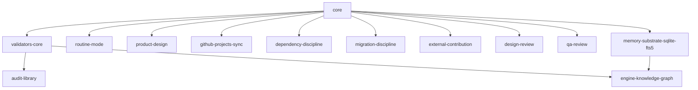

# Module catalog

The packaging view: each installable bundle, its dependencies, and its status. Design depth for each
capability lives in [systems/](../architecture.md); this catalog is what the
[module system](../spec/systems/grammar/module-system.md) and [provisioning](../spec/systems/infrastructure/provisioning.md)
operate on. Build order is the topological sort of the dependency graph below (see wbs).

> The optional-module roster is resolved ([D-068](../adr/0068-q1-resolved-the-v1-optional-module-roster-4-cut-2-kept.md)): six prototype bundles were
> adjudicated (four cut, two kept). The operator-facing **packaging model** is [D-067](../adr/0067-operator-facing-module-packaging-industry-discipline-categor.md):
> the install enumerates only the opt-out-able optional packages, grouped under three recognized SDLC
> discipline categories; the required spine is core and is never an install choice.

## Dependency graph

## Catalog

### Required (core) packages — never an install choice

These are *the Engine*. Per [D-067](../adr/0067-operator-facing-module-packaging-industry-discipline-categor.md) they are not enumerated in the install
walkthrough and are not disablable in v1; they are disclosed in plain language in the project README.

| Module | Status | Depends on |
|---|---|---|
| [core](../spec/modules/core.md) | required | — |
| [validators-core](../spec/modules/validators-core.md) | required | core |
| [routine-mode](../spec/modules/routine-mode.md) | required | core |
| [audit-library](../spec/modules/audit-library.md) | required | validators-core |
| [memory-substrate-sqlite-fts5](../spec/modules/memory-substrate-sqlite-fts5.md) | required | core |

`routine-mode` (the routine *stance*, [D-038](../adr/0038-session-lifecycle-re-founded-on-native-substrates.md)) and `audit-library` (self-checkups) are
reclassified from `default-on` to `required`/core by [D-067](../adr/0067-operator-facing-module-packaging-industry-discipline-categor.md): self-checkups and the
routine stance are core protections, not operator opt-in choices. `memory-substrate-sqlite-fts5` is the
[memory](../spec/systems/cognitive/memory.md) foundation floor — the NDJSON ledger, its derived index,
capture, and the `search` interface — a `required` package ([D-086](../adr/0086-cognitive-foundations-as-required-packages-reconciliation-me.md)) because it owns
the engine's only gitignored, non-regenerable per-instance store (so its schema needs an owned migration
unit) and the `search` seam the optional semantic layer binds to. The [knowledge](../spec/systems/cognitive/knowledge.md)
foundation has no separate package: its committed entities + derived index ride **`core`'s `provides`**
(regenerable, no per-instance store to migrate).

### Operator-facing optional packages — the install menu

The only packages the install walkthrough presents (the operator opts *out* of these). Grouped under
recognized SDLC discipline categories ([D-067](../adr/0067-operator-facing-module-packaging-industry-discipline-categor.md); the grouping is provisioning
selection-UX presentation data keyed by module `id`, not a manifest field).

| Category | Module | Status | Depends on |
|---|---|---|---|
| Product Management | [product-design](../spec/modules/product-design.md) | optional | core |
| Product Management | [github-projects-sync](../spec/modules/github-projects-sync.md) | optional | core |
| Software Configuration Management | [dependency-discipline](../spec/modules/dependency-discipline.md) | optional | core |
| Software Configuration Management | [migration-discipline](../spec/modules/migration-discipline.md) | optional | core |
| Software Configuration Management | [external-contribution](../spec/modules/external-contribution.md) | optional | core |
| Verification & Validation | [design-review](../spec/modules/design-review.md) | optional | core |
| Verification & Validation | [qa-review](../spec/modules/qa-review.md) | optional | core |

### Experimental — deferred swap seam (not on the operator menu)

The optional semantic-recall / graph-representation layer atop the memory ledger, behind the swappable
`search` interface ([D-086](../adr/0086-cognitive-foundations-as-required-packages-reconciliation-me.md)). It is **not** on the [D-067](../adr/0067-operator-facing-module-packaging-industry-discipline-categor.md) operator
menu: it fits none of the three SDLC discipline categories and its representation/retrieval engine choice
is deferred to [Q11](open-questions.md). Listed here for catalog coverage.

| Module | Status | Depends on |
|---|---|---|
| [engine-knowledge-graph](../spec/modules/engine-knowledge-graph.md) | experimental | validators-core, memory-substrate-sqlite-fts5 |

### Future optional (post-v1) — named, not yet built (not on the operator menu)

Slots held in the end-state catalog whose design is deferred to a dedicated session and whose build is **out of v1 scope**. Unlike the experimental swap-seam above, these are named here so the grammar has a home, not hidden; their operator-facing-vs-engine-infra placement is decided at promotion.

| Module | Status | Depends on |
|---|---|---|
| [clean-code](../spec/modules/clean-code.md) | stub (post-v1) | core |
| [product-knowledge-graph](../spec/modules/product-knowledge-graph.md) | stub (post-v1) | core |

**`clean-code`** ([D-095](../adr/0095-cut-expression-contracts-disposition-prose-organization-cove.md)) — audience-keyed **code-style governance**: a parent module that injects per-language standards into the coding/worker [agents](../spec/systems/surfaces/agents.md) and runs a commit-boundary linter [check](../spec/systems/surfaces/check.md) (a local nudge; CI is the unbypassable gate), extended by per-language **packs** (e.g. PEP 8/ruff for Python) that depend on `clean-code`. Its revisit signal is a quality-consistency pressure rather than operator intuition — recurring cross-session code-style divergence or repeated operator style-steers where a posture-only style stance (the [conduct](../spec/systems/surfaces/conduct.md) behavioral floor) and [memory](../spec/systems/cognitive/memory.md)'s learned preferences stop holding consistency, the point an *enforced* per-language injection seam is earned. Every realization path it could take is additive within the locked grammar, so adding it later never forces a refactor — check-kinds and agents bind by presence, and a dedicated tier-3 surface (if its design session chooses one over reuse) attaches without an [ontology](../spec/systems/grammar/ontology.md) re-lock. On promotion it joins the **Verification & Validation** category on the operator menu (it governs the operator's own product code — unlike the engine-infra `engine-knowledge-graph`). Its realization (reuse vs. a new tier-3 surface) and the standards-injection seam into worker subagents are open design-session threads. It is **deliberately absent from the v1 dependency graph above**: post-v1, it does not enter the WBS build-order sort; `core` is its only certain root, with precise deps re-derived in its design session. **Disclosure:** v1 ships with no automated code-style/lint floor; the project README states this and names `clean-code` as the planned remedy ([D-095](../adr/0095-cut-expression-contracts-disposition-prose-organization-cove.md)).

**`product-knowledge-graph`** ([D-105](../adr/0105-hold-a-post-v1-product-knowledge-graph-module-stub-product-s.md)) — the product-side analogue of the [knowledge](../spec/systems/cognitive/knowledge.md) foundation: a **derived structural graph of the product's structure** — derived from the product's canonical structural artifacts (product code where present, the product's authored structural model otherwise) — integrated into the cognitive substrate, so a cold session reasons over the product's shape without re-deriving it live each session. v1's knowledge foundation maps only the *engine's* governed surfaces (its self-map, [D-042](../adr/0042-procedural-content-grounding-surface-cluster-designed-the-bo.md)); this extends that structural leg to the product. Its revisit signal is engine-observable rather than operator intuition: cold-session structural live-read straining the bounded cold-context budget [attention](../spec/systems/cognitive/attention.md) allocates at boot as the product grows (the live-read-cost bet inverting at scale) — a live-read *cost* signal, not a graph-density or drift risk. It is **derived, not hand-authored**, holds **structure, not belief** (beliefs stay in [memory](../spec/systems/cognitive/memory.md)), reuses the swappable knowledge representation/retrieval seam (the [R8](risks.md) hub-explosion concern stays deferred behind it at product scale), and is **read-only over the product's artifacts** with an engine-owned, gitignored index (the [§13](../principles.md) wall holds). Distinct from the experimental [engine-knowledge-graph](../spec/modules/engine-knowledge-graph.md) (semantic recall over the memory ledger). **Deliberately absent from the v1 dependency graph**: post-v1, it does not enter the WBS build-order sort; `core` is its only certain root, with precise deps (the knowledge/`search` seam, memory) and its operator-facing-vs-engine-infra placement re-derived in its design session. Whether its cognitive-substrate integration is fully additive or needs a seam into the locked knowledge foundation is the central design-session question.

Scope note (operator-facing packaging, [D-067](../adr/0067-operator-facing-module-packaging-industry-discipline-categor.md)): the install walkthrough enumerates
only the opt-out-able optional packages above, grouped under the **Product Management / Software
Configuration Management / Verification & Validation** discipline categories. The required spine
(including `routine-mode` and `audit-library`) is core, never presented as an install choice, and
disclosed in the project README. Categories are durable industry umbrellas (IEEE 1012 / SWEBOK) that scale
to dozens of future modules; the grouping lives as provisioning presentation data keyed by module `id`,
so it is additive to the locked [module-system](../spec/systems/grammar/module-system.md) grammar.

Scope note (Q1 roster, [D-068](../adr/0068-q1-resolved-the-v1-optional-module-roster-4-cut-2-kept.md)): four prototype bundles were **cut** —
`code-review-bundle` (absorbed by the [qa-review](../spec/modules/qa-review.md) pre-submission lenses, plus the
separate post-merge `retroactive` lens — not part of the qa-review quintet, but an additive lens a future
module may ship),
`quality-gates` (expressible as `check` rules in the validation foundation), `github-collab-bundle` (its
residual travels via [control-plane](../spec/systems/infrastructure/control-plane.md) files +
`github-projects-sync`), and `frontend-discipline` (single-domain, not a cross-cutting discipline;
expressible as check rules / a future V&V lens). Two were **kept** as `optional` Software Configuration
Management modules: `dependency-discipline` and `migration-discipline`.

Scope note: the foundational security floor (secret scanning + `dependabot.yml`) belongs to the [control plane](../spec/systems/infrastructure/control-plane.md); `dependency-discipline` owns dependency *discipline* (pinning, cadence, review gates), not the floor.

Scope note (cognitive substrate, [D-086](../adr/0086-cognitive-foundations-as-required-packages-reconciliation-me.md)): the cognitive floor is part of the required spine. The [memory](../spec/systems/cognitive/memory.md) foundation floor is its own `required` package (`memory-substrate-sqlite-fts5`) — it owns the engine's only gitignored, non-regenerable per-instance store (the NDJSON ledger, so its schema needs an owned migration unit) and the `search` interface seam the semantic layer binds to. The [knowledge](../spec/systems/cognitive/knowledge.md) foundation has no separate package: its committed entities + derived index ride `core`'s `provides` (regenerable, no per-instance store to migrate). **Semantic recall** (embeddings + rerank / graph representation, `engine-knowledge-graph`) is the one genuinely optional/experimental layer atop the ledger, behind the swappable `search` interface — the [D-024](../adr/0024-the-engine-is-upgradeable-versioned-packages-upgraded-by-ove.md) split of FTS5-floor (required) from semantic-module (optional), now reflected in the catalog rows and dependency graph above.

Scope note (design → build → QA axis, [D-065](../adr/0065-product-design-front-door-design-the-q14-intake-module-as-a.md)/[D-066](../adr/0066-the-4-4-review-lens-roster-two-stage-suites-mirroring-the-en.md)): [product-design](../spec/modules/product-design.md) is the operator's intent-to-spec front door — it authors a committed, validated `docs/spec/` spec corpus (the producer of the acceptance-criteria *referent*) plus a build-plan, and ships the spec form/coverage/lock-integrity checks ([D-244](../adr/0244-re-litigate-product-design-into-a-first-class-spec-driven-de.md)); [design-review](../spec/modules/design-review.md) and [qa-review](../spec/modules/qa-review.md) are the two agent-suite rosters that fill build orchestration's plan-review and pre-submission gates (the lens-membership part of [Q1](open-questions.md), resolved by [D-066](../adr/0066-the-4-4-review-lens-roster-two-stage-suites-mirroring-the-en.md)). All three depend only on `core` and compose existing surfaces — no new ontology. The review suites review *all* build work, so they are kept separate from product-design rather than gated behind intake.

Scope note (lifecycle decomposition, [D-038](../adr/0038-session-lifecycle-re-founded-on-native-substrates.md)/[D-073](../adr/0073-lock-build-orchestration-wave-3-terminal-and-re-litigate-con.md)): the **build orchestration workflow is core** (a `required` package). [D-073](../adr/0073-lock-build-orchestration-wave-3-terminal-and-re-litigate-con.md) resolved the lifecycle required-package decomposition: `session-lifecycle` and `build-readiness-gate` are **folded into `core`** — the plan-review *gate* is part of the core orchestration workflow (its review *lenses* are the [design-review](../spec/modules/design-review.md)/[qa-review](../spec/modules/qa-review.md) modules, [D-066](../adr/0066-the-4-4-review-lens-roster-two-stage-suites-mirroring-the-en.md)) — and both stub modules are deleted. `routine-mode` (the routine *stance*) depends on `core`. `github-projects-sync` depends on `core` (the cut `github-collab-bundle` and the former `session-lifecycle` root were the D-038 `github-*` edges, now re-cut).

Scope note (external contribution, [D-102](../adr/0102-cross-repo-external-contribution-as-a-first-class-v1-operati.md)): [external-contribution](../spec/modules/external-contribution.md) is the **optional** module realizing the cross-repo [external-contribution](../spec/systems/lifecycle/external-contribution.md) arrangement — the Engine contributing to a product repo the operator does **not** own (an open-source project, or the engine-mechanic building engine-template). It is grouped under **Software Configuration Management** (the fork → upstream contribution workflow is a configuration / version-control discipline) and `depends: core` (its outgoing-diff nudge presupposes no engine-self-validation corpus, so it does not take the `validators-core` edge). It is the **engine-mechanic's vehicle**; design depth lives in the lifecycle system doc, and its locked-doc seams are landed ([D-104](../adr/0104-phase-c-cross-reference-the-external-contribution-mode-into.md)).
