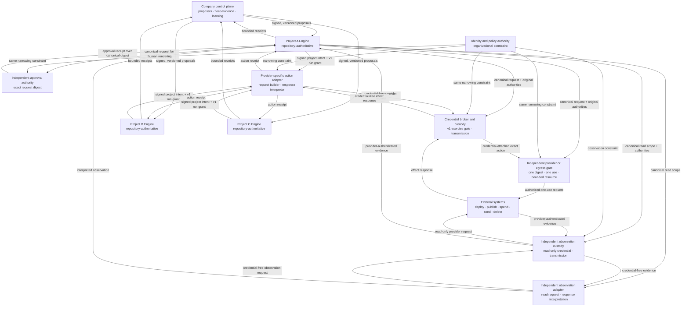
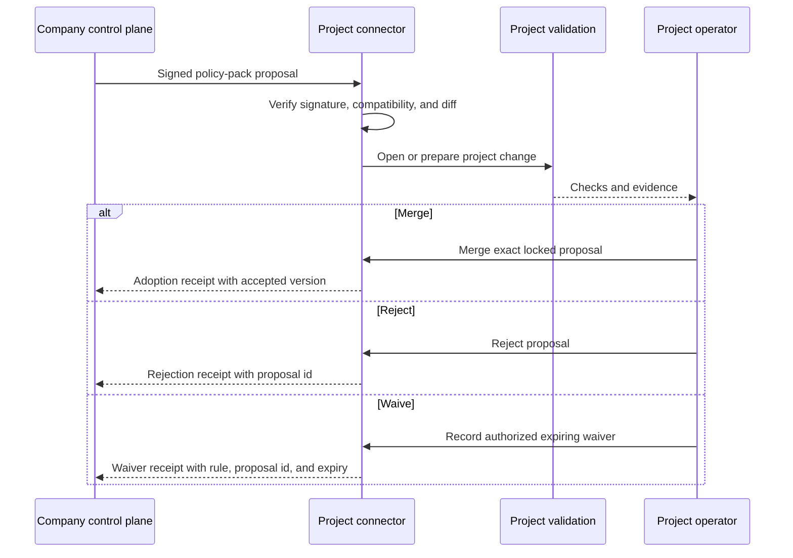
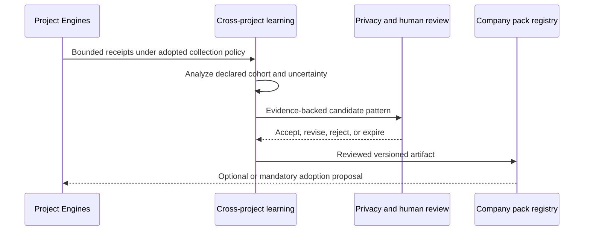

# Company layer

## Summary

The company layer is a candidate post-v1 system for operating many sovereign project Engines as a governed
fleet. It gives an organization one place to observe Engine health, propose common policy, assign narrow
authority, mediate high-impact external actions, and learn from evidence across projects without making the
organization the owner of each project's truth.

This document is a **v2 target proposal**, not an accepted release commitment, implementation plan, or build
order. It assumes the whole v1 Engine contract, including the forward-designed delivery-plane capabilities,
is available first. In particular, it composes the repository topology, control plane, module system,
validation and audit surfaces, operator cockpit, evidence explorer, authority-broker contract, credential
broker, deployment and operations modules, product knowledge graph, and research-and-learning module. It does
not move unfinished v1 work into v2.

### The weakness this repairs

V1 deliberately gives one project Engine two authoritative homes: the repository holds reviewed state,
decisions, guardrails, evidence, and product work, while a gitignored local ledger holds experiential memory.
Together those project-scoped stores produce the qualities the Engine is designed around:
trustworthiness, cold-start capability, reversibility, auditability, graceful degradation, low ceremony,
portability, and composability. It also leaves each Engine as an organizational island.

An organization with many Engines can govern each project well, but v1 does not supply a first-class way to:

- see fleet health and evidence freshness without entering every repository;
- distribute an organizational rule while preserving each project's reviewed acceptance;
- express one person's authority consistently across projects and external systems;
- mediate consequential actions such as publishing, spending, deploying, deleting, or contacting people;
- distinguish a locally useful lesson from a pattern supported across projects; or
- promote a proven pattern without copying private project memory into a global brain.

The company layer repairs that missing federation boundary. It carries v1's strengths up one level:
repository authority becomes project sovereignty, reviewed consent becomes governed adoption, local evidence
becomes fleet evidence, narrow runtime permissions become organizational capability grants, and reversible
modules become removable company packs.

### Intended operators and accountability

V1 is optimized for a capable solo operator or small team. This target deliberately enters a multi-party
environment, so it cannot inherit that single-operator assumption unchanged. It introduces four visible roles:

| Role | Accountable for | Required separation |
| --- | --- | --- |
| Company policy owner | Organizational rules, deadlines, waivability, and fleet eligibility | Cannot approve their own consequential action or unilaterally replace the recovery trust root |
| Project operator | Product intent, project adoption, stricter local rules, and project exit request | Cannot enlarge a company grant or waive a non-waivable rule |
| Action approver | Human judgment over one complete consequential-action request | Must be independent of the requester for protected action classes |
| Privacy and evidence steward | Collection purpose, access, retention, cohort safety, and knowledge promotion | Cannot promote evidence they alone supplied or change the underlying receipts |

One person may hold several roles in a small organization only where the effective policy explicitly permits
it. Protected action classes, trust-root recovery, privacy exceptions, and mandatory-policy waivers require
separation of duties. Every interface must remain legible to the capable non-engineer: it presents the pending
decision, consequence, evidence, expiry, and recovery path rather than internal policy or protocol vocabulary.

### V1 foundations and v2 extension

| V1 foundation | Strength retained | Company-layer extension |
| --- | --- | --- |
| Repository topology and versioned template | A project repository is the durable source of reviewed truth | Every project remains sovereign; fleet membership is an explicit, reversible relationship |
| Control plane, policies, and protected merges | Rules change through inspectable review | Company policy arrives as a signed, versioned proposal that the project adopts through its own review gate |
| Modules, provisioning, and upgrades | Capability is declared, wired, and removable | Company packs use the same file-and-wiring discipline and expose adoption and rollback receipts |
| Memory, knowledge, and state separation | Raw work and durable truth have different homes | Only explicitly classified protocol records cross the project boundary; raw session memory stays local |
| Validation, audits, telemetry, and delivery evidence | Claims are backed by inspectable evidence | A fleet view aggregates provenance and freshness without replacing project evidence |
| Operator cockpit and evidence explorer | A capable operator can weigh work rather than read implementation detail | A fleet cockpit shows exceptions, drift, pending proposals, and consequential actions across projects |
| Authority-broker contract and credential broker | Tools receive narrow authority instead of ambient secrets | Organizational identity is translated into expiring, project-scoped capability grants |
| Deployment, operations, and bounded repair | Side effects are planned, observed, and recoverable | A company action broker mediates high-impact external work and returns a complete receipt |
| Product knowledge graph and research-and-learning | Learning is evidence-bearing and advisory | Cross-project analysis may propose a shared pattern; promotion still requires privacy and human review |
| Runtime adapters | One Engine contract survives different assistants | Company semantics remain runtime-neutral; adapters may differ without changing authority or evidence rules |

### Core invariants

1. **Project authority remains local.** The repository remains authoritative for reviewed project truth and
   the local memory ledger remains authoritative for experiential recall. The company layer may observe,
   propose, and broker; it cannot silently revise either store.
2. **Project-private memory stays private by default.** Raw transcripts, scratch state, source content,
   secrets, and product data do not become company memory merely because a project joins the fleet.
3. **The company service is never the sole copy of project truth.** A project can reconstruct its approved
   posture from its repository and recover experiential recall from its local or separately backed-up memory
   substrate without treating the company service as a memory backup.
4. **Policy enters through review.** Company policy reaches a project as a versioned proposal, normally a pull
   request, and becomes active only through the project's protected acceptance path.
5. **The project may be stricter.** Local policy may narrow company-granted authority. Weakening a mandatory
   company rule requires an explicit, attributable, expiring waiver.
6. **Disconnection degrades, not disables.** A project continues from its last approved company state while
   reporting staleness and refusing actions whose grants cannot safely survive disconnection.
7. **Authority is narrow and attributable.** Grants are scoped to an identity, project, action, resource,
   environment, and time window; they are expiring and revocable.
8. **Learning proposes.** Neither fleet evaluation nor cross-project learning silently changes policy,
   prompts, skills, modules, or memory.
9. **Removal does not unbuild the product.** Leaving the fleet removes company integration without making the
   project's product or ordinary local Engine work depend on a vanished service.
10. **Compromise is contained.** Compromise of one project cannot mutate company policy or another project.
    Compromise of the company control plane alone cannot write repositories, mint usable external authority,
    approve a protected action, or obtain provider credentials.
11. **Brokered means non-bypassable.** A provider family is called brokered only when credential custody and
    an independently enforced provider or egress control prevent direct unrecorded use. Any successful bypass
    fails adapter admission. The cockpit may label that candidate integration as partial, but the company layer
    must not call it brokered or make a complete-action claim.

## Behavior

### System boundary and topology

The company layer is a federation control plane around project Engines. It has no privileged path around the
project's repository, Engine gates, or operator. Projects send bounded receipts outward and receive proposals
or company authorization constraints inward. Company authorization is never itself an executable grant: it
can only narrow the v1 authority chain. Consequential external actions use a provider-specific adapter only
after policy classifies the action and the combined adapter, broker, provider, and egress path proves custody,
confinement, observation, and recovery.



Project A is the representative action and observation path in this fleet diagram; Projects B and C use the
same direct approval, broker, egress, and observation edges. Those repeated edges are omitted only to keep the
diagram readable, not because their authority path differs.

The project-to-company connection is an installed integration with a declared manifest. The manifest names
the company endpoint, pinned recovery and signing-root identifiers, receipt classes, adopted policy-pack
versions, offline behavior, and removal procedure. Enrollment adds a company project identifier and an
instance key proved by possession; the private key is local state, never repository content. Where the runtime
supports it, the key is non-exportable and hardware- or runtime-bound. Otherwise enrollment records a device
binding and enforces concurrent-use and clone detection; suspected duplication suspends the instance and
requires rotation or re-enrollment. Cloning, reinstalling, rotating, revoking, and re-enrolling create distinct
instance identities and receipts, so a copied manifest cannot impersonate its source and a copied local key is
detected and contained rather than assumed impossible. Joining is a reviewed project change; departure is a
project request whose organizational consequences follow the adopted fleet-eligibility policy.

Fleet facts remain instance-addressed even when the cockpit rolls them up by project. Every receipt binds the
instance identity and repository revision or other source-state digest. The project declares which enrolled
instances are active for each receipt class; revoked, departed, or expired instances remain visible but do not
contribute current claims. A project-level fact is current only when every active in-scope instance reports a
compatible binding. Divergent valid instances produce a visible conflict with each contributing receipt,
never a last-writer-wins project value.

The minimum receipt plane is part of the federation substrate, not assumed from v1 telemetry. It supplies
mutually authenticated enrollment, schema negotiation, ordered identifiers, bounded encrypted local spooling,
backpressure, replay and deduplication, central durable storage, acknowledgement, retention enforcement, and
reconnect reconciliation. Its bootstrap policy permits only enrollment and the minimum health fields disclosed
in the joining change. Broader collection requires a later adopted collection policy.

### Authority and precedence

Authority has distinct homes. A higher row does not acquire the lower row's authorship rights merely because
it constrains them.

| Layer | Owns | Must not own |
| --- | --- | --- |
| Engine release | Universal machinery, schemas, validation semantics, runtime-neutral contracts | Organization policy or project intent |
| Company policy authority | Organizational constraints, identity mapping, fleet policy packs, broker classifications | Product decisions, raw project memory, direct repository mutation, provider credentials |
| Independent approval authority | A human decision over one protected request digest | Policy authorship, request authorship, provider execution |
| Credential custody | Provider credentials and provider-enforced resource limits | Policy authorship, human approval, project intent |
| Project | Product intent, local conduct, accepted company pack versions, stricter local rules, waiver records | Company signing roots or another project's state |
| Runtime adapter | Translation to the assistant and tools available in one runtime | A competing authority model |
| Session | One task's working context and explicitly granted capabilities | Durable policy or reusable ambient authority |

Every company policy rule declares an identifier, version, owner, scope, enforcement tier, whether a project
may strengthen it, whether it is waivable, the waiver authority and expiry, offline behavior, and evidence
requirements. Precedence is deterministic:

1. the Engine's universal safety and repository-integrity contracts apply;
2. an adopted mandatory company rule applies within its declared scope;
3. a project may narrow authority or strengthen an obligation;
4. a project may weaken a waivable company rule only with a valid recorded waiver; and
5. runtime and session instructions may narrow authority further but cannot enlarge it.

Policy conflict is a visible blocked state, not a last-writer-wins merge. The project remains on its last
coherent approved policy set until the conflict is resolved.

An adopted mandatory rule includes an adoption deadline and a consequence ladder. Before the deadline the
cockpit reports pending adoption. After it, the project is nonconformant and new company-brokered authority is
suspended; organization-controlled repository or provider access may also be restricted only by a named
company policy owner through mechanisms outside the project Engine. The project and product continue to run
locally. The operator can adopt, obtain an authorized expiring waiver, appeal, or depart; restoring compliance
requires a new successful adoption receipt, while a valid waiver may temporarily restore eligibility when the
rule's consequence policy permits it. Thus sovereignty controls what enters the repository, while the
organization controls eligibility for company resources—it never turns “mandatory” into a silent merge.

### Capability areas

#### 1. Fleet registry and observation

The fleet registry records which projects opted in, the Engine and company-pack versions they report, receipt
transport freshness, time-bounded project attestations of locally derived evidence freshness, runtime
coverage, and degradation state. Because only the project can compare evidence bindings with its current
private tree, the fleet never derives evidence freshness itself. An attestation identifies its source binding
and time; it expires or is superseded when the project tree changes.

The fleet cockpit is an exception-oriented view over those receipts. In one view it shows project health,
transport and evidence freshness as separate facts, drift, failed validation, pending adoption decisions,
open waivers, expiring grants, and consequential action outcomes across multiple projects.

The cockpit links every aggregate claim to the contributing project receipts and marks incomplete coverage.
It does not imply that absence of a receipt is success. A project can inspect the exact receipt it emitted,
and a company operator can see which policy authorized collection of each field.

#### 2. Policy and capability-pack distribution

The company layer publishes signed, immutable versions of policy packs and optional capability packs. This is
an explicit v2 extension to distribution, not a capability v1 already has: v1 co-ships every module in one
tagged Engine release, checks the one installed set, and has no external package registry or multi-version
solver. V2 therefore needs a signed company-pack catalog and source protocol plus a project-reviewed lock that
records one exact pack version, source, content digest, compatible Engine release, and dependency set. A
proposal materializes that exact set into the project tree; it never follows an ambient `latest` tag or lets a
solver choose a different set at install time.

The external catalog envelope is the v2 schema extension; once materialized, its contained module manifest
uses the unchanged v1 grammar rather than inventing new fields or a second wiring system. The envelope carries
source, digest, Engine compatibility, and organization namespace. The v1 manifest carries `id`, `version`,
`distribution`, `applicability`, `activation`, the independent `maturity` and `lifecycle` markers where
applicable, `provides`, `wires`, `depends`, `migrations`, and any applicable retirement record. Ownership
derives from `provides`; removal derives from the module manager's reversal of
owned files and wires. A rollback is a reviewed project change that restores the prior lock and bytes, then
uses v1 uninstall, install or upgrade and forward migrations as applicable—it is not a nonexistent v1 manifest
field or an assumed reverse migration. Installation refuses module-id, file-provider, wiring, dependency,
digest, release-compatibility, or version collisions. Company pack owners cannot claim Engine-owned paths or
bypass the project's normal ownership and protected-review treatment. The company pack owner publishes the
catalog envelope, compatible bytes, and forward migrations; the project owns the adopted lock and proposal;
the Engine module operation owns coherent apply and dependency-safe removal. Stage C must settle this
source-and-lock extension and rollback limits before any pack is admitted.

A project connector compares the offered pack with the locally adopted version and opens or prepares a
project proposal. Normal project validation and review then decide whether it lands. Urgent revocation may
make a broker refuse new actions immediately, but it still cannot silently rewrite the repository; the
durable project policy update follows through review.

#### 3. Organizational identity and capability grants

The company layer maps organizational identities and groups to constraints on Engine roles without copying
identity-provider credentials into projects. It does not mint a parallel executable grant. For a company-
brokered action the v1 authority chain remains authoritative and requires provider consent, possession-proven
workload identity, a live-run task grant, exact request digest and nonce, required human approval, and the v1
exercise checks. The company contributes an independently signed constraint binding:

- requesting human or service identity;
- originating project and Engine instance;
- exact action and resource scope;
- environment and data classification;
- approving policy version and any human approval;
- issue time, expiry, and revocation handle;
- the v1 provider-consent, workload-identity, live-run grant, request-digest, and nonce references; and
- correlation identifier for the resulting receipt.

The action adapter computes the intersection of the company constraint with a project-produced, version-bound
effective-policy attestation, then the project performs a mandatory local second gate immediately before
exercise. A mismatch or stale attestation fails closed. The broker consumes narrow authorization decisions;
projects, runtimes, and adapters never receive the provider credential. Any authority in the chain can narrow
or revoke; no authority can enlarge an
upstream grant. Failure to establish identity or run liveness fails closed.

#### 4. External-action broker

The broker is a common contract realized by separately admitted provider-family adapters. V2 begins only with
families that have action-specific request schemas, credential confinement, provider-enforced resource or
spend limits, an independently administered provider or egress gate, idempotency, independent provider-side
observation, reconciliation, recovery, and conformance fixtures. V1 deployment adapters are the first
candidate. Sending, publishing, spending, deleting durable
data, changing shared systems, escalating privilege, and contacting people are target families, not inherited
capabilities; each needs its own admitted adapter before the company layer claims to mediate it. Ordinary
reversible local edits remain project work and do not take a network dependency on the broker.

For a brokered action, the project submits an exact intent rather than a general credential request. The
credential broker verifies the complete v1 chain and the company constraint; the adapter only builds a
credential-free provider request and interprets a credential-free response. Deletion, spending, external
publication or communication, privilege escalation, and actions without reliable reversal are non-waivable
protected classes: an independent human approval bound to the complete request digest is always required. Approval has
an authenticated channel, expiry, replay protection, rejection, timeout, escalation, and unavailable-channel
behavior; unavailable or ambiguous approval fails closed. The adapter returns a receipt binding request,
decision, grants, approval, execution, provider observation, result, timestamps, and recovery. Retries are
idempotent or explicitly new actions. Provider-side reconciliation exposes omitted, fabricated, or disputed
broker outcomes.

Credential custody is a high-impact residual trust domain, not described as fail-closed under its own
compromise. It holds a provider credential, but that credential is provider-limited to the smallest resource,
operation, environment, spend, and lifetime the provider supports, and custody has no unrestricted provider
network route. An independently administered provider policy or egress gate requires a separately signed,
single-use authority bundle bound to the complete request digest before transmitting the exact request. It
verifies the original provider consent, workload identity, live-run grant, company constraint, human approval,
and fresh project approval itself; it does not trust a decision minted by custody.
Compromise of custody alone is therefore bounded to whatever the provider cannot express and the independent
gate cannot distinguish; that residual is declared per adapter. If the adapter cannot demonstrate that a
custody attacker is blocked from every other provider request and route, it fails broker admission.

#### 5. Cross-project evaluation

Company evals consume bounded, schema-versioned receipts. They may measure adoption, evidence completeness,
action outcomes, recovery success, cost, latency, and explicitly approved product-quality signals. Results
carry cohort definition, coverage, uncertainty, provenance, and data-retention class.

A signature proves receipt origin and integrity, not truth. Evaluation assigns source-quality and
corroboration status, detects anomalous or contradictory claims, and can quarantine a project's evidence.
When evidence is later discredited, every dependent result and promoted artifact is traced, marked invalid or
under review, and prevented from driving new adoption until re-evaluated.

Fleet evaluation is advisory unless a previously adopted policy defines a mechanical gate. A new eval result
cannot retroactively create authority or silently turn a recommendation into enforcement.

#### 6. Curated shared knowledge

The company layer distinguishes **receipts** from **promoted knowledge**. Receipts report bounded facts about
one event. Promoted knowledge is a reviewed artifact—such as a policy rule, module, profile, eval case,
operating pattern, or redacted incident lesson—that is intentionally made reusable.

Cross-project learning may identify a candidate pattern only when its evidence spans the declared cohort and
its privacy treatment is known. Promotion requires a named owner, evidence links, applicability boundaries,
privacy review, expiry or reconsideration trigger, and human acceptance. Projects adopt the resulting artifact
through the same versioned proposal path as any other pack.

#### 7. Adoption, degradation, and recovery

Fleet state uses independent axes rather than one lossy lifecycle value:

| Axis | Values |
| --- | --- |
| Enrollment | `unmanaged`, `invited`, `enrolled`, `departed` |
| Connectivity | `online`, `offline`, `unknown` |
| Policy-set coherence | `coherent`, `stale`, `conflicted` |
| Policy-item status | A map keyed by pack/rule plus version or proposal id: `current`, `pending`, `waived`, `expired`, or `rejected` |
| Health | `healthy`, `degraded`, `unknown` |
| Company authority | `eligible`, `restricted`, `suspended` |

Each axis has independent transition, receipt, expiry, and recovery rules. Policy-item status is deliberately
multi-valued: one project may have a current pack, a pending pack, and one waived rule at the same time, while
the policy-set axis says whether those items still resolve to one coherent effective policy. A waiver does not
make its rule current or erase the missed adoption; it records a temporary exception until its expiry. Company
authority becomes eligible again during that window only when the consequence policy explicitly permits it,
then returns to suspended if the waiver expires before adoption. Full compliance returns only after a new
successful adoption receipt. A project can therefore be online, coherent, degraded, and eligible without
hiding the item-level exceptions that explain that state.

When the company service is unavailable, the project uses its last approved policy packs, retains local
evidence, queues only receipts allowed by retention policy, and marks company-dependent views stale. It may
continue local work. Protected action classes and any action requiring fresh company authority are
non-waivably online-only. Other offline grants have a policy-bounded maximum lifetime; a revocation issued
while disconnected wins on reconnection and triggers reconciliation of any explicitly permitted offline
effects. Reconnection reconciles versions and receipts without overwriting newer project truth.

#### 8. Exit and removability

A project can request fleet departure through a reviewed removal change. The adopted eligibility policy names
who accepts the organizational departure and what company-controlled access ends; neither side can use exit to
rewrite the other's records. Exit centrally revokes outstanding grants, instance enrollment, transport
credentials, and company-controlled project access before the connector is removed. Every later receipt or
action request from those identities is rejected and recorded. The local change stops new receipt emission,
removes connector wiring, retains the local record of adopted policy and action receipts, and identifies any
company pack whose removal needs an explicit migration. The product remains runnable and the local Engine
remains capable of cold start.

The company layer itself can be replaced. Export formats cover policy-pack and collection-policy history,
fleet membership and instance enrollment, identity mappings, waivers, approvals, grant and revocation records,
public signing and recovery-root bindings, receipt replay and acknowledgement positions, reconciliation
cursors, retention and legal-hold metadata, promoted artifacts, and broker receipts without exporting private
project memory that was never in scope or raw provider credentials. Replacement freezes new broker actions,
verifies and imports the export, rotates signing roots through the separately held recovery path, re-enrolls
each project instance, reconciles every spool and acknowledgement cursor, and issues fresh grants. Provider
consent and credential custody are re-provisioned or rotated through their independent owners before action
service resumes; live grants and private signing or provider keys do not cross the replacement boundary.

### Boundary data

| Class | Examples | Default handling |
| --- | --- | --- |
| Project-private | Raw transcripts, scratch state, source content, secrets, product data, private tuning inputs | Never exported merely by fleet membership |
| Project receipt | Engine and pack versions, validation result, evidence freshness, adoption state, broker action outcome, aggregate approved metric | Export only fields declared by adopted collection policy; minimize and retain by class |
| Broker action protocol | The project sends canonical intent, original project authorities, and the independent human approval receipt directly to effect custody and egress; company policy independently sends the same narrowing constraint to approval, effect custody, and egress; the effect adapter receives only the fields needed to build the provider request. For observation, the project sends canonical read scope and applicable authorities directly to read-only custody while an admitted observation adapter separately builds the credential-free provider read; company policy sends the observation constraint directly to custody. The provider receives only each exact request | The adopted action policy enumerates every recipient and its minimized fields, purpose, expiry, retention, and audit obligations. Each enforcement domain assembles and verifies its complete authority set from independent inputs and checks adapter output against the canonical request. Provider-authenticated observation evidence returns directly to the project as well as to the interpreting adapter; no intermediary may silently widen or relay authority or become the sole evidence source |
| Company authority data | Identity mapping, policy decision, approval, grant metadata, revocation state | Company-managed; project receives the minimum decision and receipt needed for audit |
| Promoted shared artifact | Policy pack, module, profile, eval case, pattern, redacted incident lesson | Versioned, reviewed, attributable, and adopted by projects explicitly |

Receipts use stable schemas, data classification, purpose, retention, and provenance fields. Collection policy
is reviewable in the project. Aggregation is not treated as anonymization: a privacy review must consider
whether a small cohort or linked fields can reconstruct project-private facts. Aggregate release applies
minimum-cohort, attribute-linkage, and differencing tests; it suppresses or generalizes unsafe fields and
refuses the query when those controls cannot establish the declared privacy bound.

Central storage is segmented by project and purpose. Role- and project-scoped access, field minimization,
retention deletion, legal hold, export, and administrative access are enforced and audited. The fleet cockpit
shows aggregate-to-project links only to an identity authorized for both the aggregate purpose and underlying
project. A breach or revoked identity can be contained to its permitted projects and data classes.

### Principal workflows

#### Policy adoption



#### Consequential external action

```mermaid
sequenceDiagram
    participant E as Project Engine
    participant P as Company policy authority
    participant H as Independent human approver
    participant B as Provider-family adapter
    participant C as Effect credential custody
    participant G as Independent provider or egress gate
    participant A as Independent observation adapter
    participant O as Independent read-only custody
    participant X as External system
    E->>H: Canonical signed intent and original authority references
    P-->>H: Independently signed narrowing constraint
    H->>H: Derive human-readable effect and recovery from canonical schema
    H-->>E: Authenticated expiring approval or rejection over canonical digest
    E->>B: Canonical request, approved digest, local-policy attestation
    P-->>B: Independently signed narrowing constraint
    B->>E: Pre-exercise challenge for mandatory local gate
    E-->>B: Fresh project approval over the same digest
    E->>C: Canonical request + project authorities + human approval receipt
    P-->>C: Same independently signed narrowing constraint
    E->>G: Canonical request + project authorities + human approval receipt
    P-->>G: Same independently signed narrowing constraint
    B->>C: Credential-free exact provider request
    C->>C: Verify full v1 and company chain; verify mapping; attach bounded credential
    C->>G: Credential-attached request
    G->>G: Independently verify original authorities and request mapping
    G->>X: Transmit exact admitted action
    X-->>C: Outcome
    C-->>B: Credential-free response and reconciliation anchor
    E->>A: Canonical read scope and reconciliation identifiers
    E->>O: Canonical read scope + applicable project authorities
    P-->>O: Independently signed observation constraint
    A->>O: Credential-free provider observation request
    O->>O: Verify authorities and adapter request mapping
    O->>X: Attach read-only credential and transmit exact request
    X-->>O: Provider-authenticated evidence
    O-->>E: Provider-authenticated evidence + custody receipt or detectable omission
    O-->>A: Same credential-free provider evidence
    A-->>E: Interpreted observation bound to provider evidence
    A-->>B: Interpreted observation bound to provider evidence
    B-->>E: Attributable action and recovery receipt
```

#### Evidence-to-pattern promotion



### Failure containment

| Failure | Required behavior |
| --- | --- |
| Company control plane outage | Projects continue from last approved state; freshness is visible; fresh-authority actions fail closed |
| Stale or incompatible policy pack | Project remains on its last coherent version and surfaces the blocked upgrade |
| Company control-plane compromise | Independent approval, project intent, local exercise gate, and credential custody prevent that plane alone from acting; recovery authority suspends it and rotates the signing root out of band |
| Approval compromise | Project intent, the local exercise gate, credential custody, and the independent provider or egress gate refuse an approval that does not match the complete request digest |
| Credential-custody compromise | The independent provider or egress gate refuses requests without valid original authorities; provider limits bound the declared residual, independent observation exposes effects or detectable omissions, and recovery revokes and rotates custody |
| Provider-adapter compromise | An adapter has no credential or provider route; altered effect requests fail the digest-bound broker and egress gates; altered observation requests fail read-custody mapping; provider evidence reaches the project without relying on adapter interpretation; and the adapter loses admission until re-proven |
| Project compromise | The project's grants are revoked; its receipts are quarantined; no authority crosses to another project |
| Identity-provider outage | Protected and fresh-authority actions fail closed; only explicitly offline-safe unexpired grants remain usable within their maximum lifetime |
| Receipt loss or tampering | Sequence, signature, and reconciliation checks expose the gap; the fleet view marks coverage incomplete |
| Truthful signature over false receipt | Source quality falls, the evidence is quarantined, and dependent evaluations and promoted artifacts are invalidated for review |
| Partial fleet adoption | Aggregates disclose their cohort and do not present non-participating projects as conformant |
| Broker retry after uncertain outcome | The idempotency key resolves the prior outcome or forces explicit human reconciliation |
| Signing-root compromise | A separately held recovery root and out-of-band project procedure suspend the signer, prevent rollback, and install a replacement root |
| Company datastore loss | Tested backups restore identity mappings, policy history, waivers, revocations, receipts, and reconciliation state to a declared recovery point |

### Non-goals and rejected shortcuts

- A global transcript store, automatic memory synchronization, or a central brain that learns by copying every
  project's work.
- A company database that becomes the authoritative copy of product intent, project decisions, or repository
  state.
- Silent central edits, forced merges, or a path around project protection rules.
- Requiring a live company service for project cold start or ordinary reversible local work.
- Automatic policy, skill, prompt, module, or model retuning from fleet telemetry.
- Broad, long-lived credentials placed in project repositories or assistant environments.
- Calling a provider family brokered when credentials or network routes still permit unrecorded direct access.
- Routing every local tool call through a remote broker.
- Replacing Git hosting, protected merges, or the operator's final product judgment.
- Treating surveillance volume as evidence quality or fleet uniformity as the goal.

### Candidate realization map

This is a dependency map for evaluating the target, not a settled build sequence.

| Stage | Coherent first value | V1 capabilities it requires | Proof before expanding |
| --- | --- | --- | --- |
| A. Federate | Enrollment, instance identity, bootstrap collection policy, receipt transport, recovery roots | [Repository topology](repository-topology.md), [control plane](control-plane.md), [validators-core](../../modules/validators-core.md), [execution environment](../../modules/execution-environment.md), and [agents](../surfaces/agents.md) | Clone resistance, reconnect, backpressure, replay, key rotation, backup restore, and private-data exclusion pass |
| B. Observe | Fleet registry, bounded signed receipts, exception cockpit | Stage A; [telemetry](../guardrails/telemetry.md), [delivery evidence](../../modules/delivery-evidence.md), [operator cockpit](../../modules/operator-cockpit.md), and [evidence explorer](../../modules/evidence-explorer.md) | A multi-project operator finds health, evidence, drift, and pending-decision exceptions with complete provenance |
| C. Govern | Namespaced signed packs, adoption proposals, precedence, waivers, deadline consequences | Stage A; [control plane](control-plane.md), [module system](../grammar/module-system.md), [provisioning](provisioning.md), and [validators-core](../../modules/validators-core.md) | A rule can be adopted, rejected, strengthened, waived, suspended, restored, rolled back, and audited without silent mutation |
| D. Authorize | Organizational constraints composed with the v1 authority chain | Stage A; [authority-broker contract](../../modules/authority-broker-contract.md), [credential broker](../../modules/credential-broker.md), [execution environment](../../modules/execution-environment.md), and [agents](../surfaces/agents.md) | Identity consistency, separation of duties, revocation, expiry, local narrowing, and effective-policy mismatch pass |
| E. Act | One admitted provider-family adapter, beginning with deployment if it qualifies | Stages C-D; [deployment core](../../modules/deployment-core.md), [deployment adapter](../../modules/deployment-adapter.md), [operations core](../../modules/operations-core.md), [bounded repair](../../modules/bounded-repair.md), and [delivery evidence](../../modules/delivery-evidence.md) | Direct bypass fails, protected actions require human approval, provider observation reconciles, and recovery works |
| F. Learn | Cross-project evals and reviewed artifact promotion | Stages A-B; [product knowledge graph](../../modules/product-knowledge-graph.md), [research and learning](../../modules/research-and-learning.md), and [profile registry](../../modules/profile-registry.md) | Multi-project evidence beats an anecdote; false evidence is quarantined; promotion remains advisory and reversible |

Before this proposal becomes a v2 program, design work must settle protocol and schema ownership, exact trust
and recovery-root custody, identity and approval providers, privacy and retention law/policy, company
deployment topology, minimum offline envelope, pack and rolling compatibility windows, receipt backfill and
downgrade behavior, and the first provider-family adapter. It must also bound a reference operating envelope:
project count, receipt cadence and size, retention, evaluation frequency, availability and recovery targets,
identity traffic, provider test environments, approval staffing, incident ownership, storage/compute budget,
and on-call expectations. Those inputs define a minimum operable deployment and make build and operating cost
weighable without fabricating an estimate in this target map.

## Acceptance criteria

In the table, `operator` means the named human role performs the observation or decision in an
operator-legible interface. `engine` means a future implementation must provide a repeatable mechanized check
or fixture and carry its result as Engine evidence; because this document is still a target proposal, the v2
program must assign each such row to a concrete check before settling it.

| Criterion | How verified | Who checks it |
| --- | --- | --- |
| A connected project remains authoritative for its product intent and accepted Engine state | Disconnect the company layer, cold-start the project, and inspect the resulting orientation and policy provenance | operator |
| Company integration cannot mutate or replace the project's experiential memory ledger | Attempt company-originated memory writes, replacement, and restore operations and verify that only the project's local memory substrate can authorize them | engine |
| A company operator can find fleet health, receipt freshness, locally attested evidence freshness, drift, and pending decisions across several projects in one provenance-linked view | Seed a mixed fleet with one exception of each class and use only the fleet cockpit to identify each project and source receipt | operator |
| Fleet membership never exports project-private memory by default | Run privacy fixtures containing marked transcripts, scratch state, source content, secrets, and product data; inspect all emitted payloads | engine |
| Every emitted receipt field is authorized by an adopted collection policy | Compare receipt schemas and payloads with the project's effective collection manifest | engine |
| Fleet aggregates disclose their contributing cohort | Inspect fleet claims under full, partial, and stale participation | operator |
| The bootstrap receipt plane authenticates instances and survives bounded disruption | Exercise enrollment, clone, key rotation, backpressure, replay, deduplication, long disconnection, reconnect, and reconciliation fixtures | engine |
| A copied repository manifest cannot impersonate an enrolled Engine instance | Clone an enrolled repository without its local key and attempt receipt submission and an action request | engine |
| A copied or stolen instance key cannot remain an undetected second identity | Attempt simultaneous and sequential use from a second runtime, then exercise suspension, rotation, revocation, and re-enrollment with hardware-bound and exportable-key fixtures | engine |
| Project-level fleet facts preserve conflicting instance evidence | Enroll multiple active instances on compatible and divergent source bindings, then revoke one; verify compatible roll-up, visible conflict, and revoked-instance exclusion | engine |
| Transport freshness and locally attested evidence freshness cannot be confused | Change a project tree after a current attestation and inspect the fleet view before and after re-attestation | engine |
| A company policy pack reaches a project as an inspectable reviewed proposal | Publish a test pack and observe the project-side diff and protection path | operator |
| A company policy pack cannot silently activate in a project repository | Attempt out-of-band activation and verify that effective durable policy remains unchanged | engine |
| Materialized company-pack bytes equal the reviewed lock and signed catalog source | Exercise substituted bytes, digest mismatch, wrong version, dependency drift, stale catalog signature, and an exact valid materialization | engine |
| A company pack cannot collide with Engine or project ownership | Exercise duplicate module-id, file-provider, wiring, dependency, incompatible-release, and removal-order fixtures | engine |
| A project can strengthen an adopted company rule | Apply a stricter local constraint and verify effective-policy resolution | engine |
| Weakening a mandatory company rule requires a valid waiver | Test absent, unauthorized, expired, and valid waiver cases | engine |
| Current, pending, rejected, and waived states remain distinct for the same pack or rule | Hold a current version while proposing its replacement, then merge, reject, and waive separate proposal fixtures; verify version/proposal-addressed states and the matching receipt type without overwriting the current record | engine |
| A policy conflict leaves the project on its last coherent approved set | Introduce incompatible pack and project rules and inspect the blocked state | engine |
| Refusing or missing a mandatory-policy deadline has a visible, reversible organizational consequence without silently merging it | Miss a deadline, observe broker suspension, then adopt or waive and verify restored eligibility | operator |
| One organizational identity receives consistent constraints across projects while each project can narrow them | Exercise one identity against two projects with common company policy and different stricter local policies | engine |
| Company authorization only narrows the complete v1 authority chain | Omit or mismatch provider consent, workload identity, live-run grant, request digest, nonce, company constraint, approval, and local exercise gate one at a time | engine |
| Every company constraint is bound to one identity and project and has expiry and revocation | Inspect and exercise multi-identity, multi-project, expiry, and revocation fixtures | engine |
| A stale or forged local-policy attestation cannot authorize an action | Change project policy after attestation and submit mismatched and attacker-authored contexts | engine |
| A protected action always requires an independent human decision over the canonical project request | Deliver the project-signed canonical request directly to approval, independently derive its effect, and attempt each protected class without, with self-, with stale-, with adapter-rewritten, and with valid approval | engine |
| A capable non-engineer can understand and decide a protected action | Give representative approvers pending requests and verify they can identify the real-world effect, consequence, evidence, expiry, recovery path, and whether approval is being requested, using the supported accessibility modes | operator |
| The approval path is authenticated, replay-resistant, expiring, and fail-closed | Exercise rejection, replay, timeout, unavailable channel, requester-as-approver, and valid independent approval | engine |
| A provider family is described as brokered only after its adapter passes admission | Verify request schema, credential confinement, provider limits, idempotency, independent observation, reconciliation, recovery, and conformance fixtures | engine |
| Direct provider access cannot bypass an admitted broker adapter | Attempt credential, API, network, and runtime bypasses and verify every path is refused | engine |
| A provider integration with any successful bypass fails broker admission | Exercise a deliberately unconfined candidate and verify it is labeled partial, excluded from broker claims, and blocked from protected company actions | engine |
| Compromise of the adapter or credential custody cannot bypass the independently enforced action decision | Give each domain attacker-level control in isolation; attempt altered digests, resources, routes, replay, and direct provider use; verify refusal or fail broker admission and record any provider-bounded residual | engine |
| Every action-protocol recipient receives only its declared fields and retains them only as declared | Trace canonical intent, authority references, provider request, effect response, and observation evidence across approval, adapter, effect custody, egress, observation custody, and provider domains | engine |
| Provider observation remains trustworthy when effect custody is compromised | Exercise suppressed, fabricated, delayed, and contradictory outcomes from effect custody and verify independent read-only observation or a detectable evidence gap | engine |
| Observation adapter or read-custody compromise cannot widen collection or forge evidence silently | Give each domain attacker-level control in isolation; attempt wider reads, altered mappings, suppression, fabrication, and replay; verify custody refusal, project verification of provider-authenticated evidence, detectable omission, or loss of adapter admission | engine |
| A brokered action receipt identifies request, policies, grants, approval, execution, independent provider observation, outcome, time, and recovery | Complete successful, rejected, failed, disputed, and recovered fixtures and inspect receipts | engine |
| An uncertain broker retry cannot duplicate an action silently | Exercise timeout and retry fixtures with the same and different idempotency keys | engine |
| A company outage leaves ordinary local Engine work available | Remove company connectivity and complete a local read, edit, validation, and review cycle | operator |
| A company outage prevents actions requiring fresh authority | Expire a broker grant while disconnected and attempt the classified action | engine |
| Revocation during disconnection cannot leave protected authority usable | Revoke identity, grant, and trust root while a project is offline, then attempt protected action before and after reconnect | engine |
| Compromise of one project grants no authority over another project | Exercise cross-project token, receipt, and connector-boundary attack fixtures | engine |
| Compromise of the company control plane alone cannot perform an external action | Give the control plane attacker-level policy and identity access while withholding independent project intent, approval, and credential custody | engine |
| Company-layer access cannot bypass project merge protection | Attempt direct company-originated repository mutation and inspect protection evidence | engine |
| Compromise recovery does not depend on the compromised signing authority | Suspend a signer and use the separately held recovery root and out-of-band project procedure to rotate it without accepting rollback | operator |
| Company authority and evidence state can be restored to a declared recovery point | Restore a backup containing identity, policy, waiver, revocation, receipt, and reconciliation fixtures and compare continuity | engine |
| The company control plane can be replaced without losing authority or receipt continuity | Freeze actions, export and import the declared state, rotate roots, re-enroll instances, reconcile spools and cursors, re-provision provider consent and custody, verify old grants fail, then complete one freshly granted brokered action with continuous receipts | engine |
| A company replacement export excludes project-private memory and raw provider credentials | Seed both excluded classes, run export and import, inspect every exported field and recipient, and verify the replacement obtains neither class | engine |
| A mixed-version fleet can roll forward and back without partition or silent data loss | Exercise schema negotiation, compatibility window, receipt backfill, datastore migration, downgrade, offline-project return, and signing-key rotation | engine |
| Central data access is purpose- and project-scoped, retained, deleted, exported, and audited as declared | Exercise cross-project access denial, administrator access logging, retention expiry, legal hold, export, identity revocation, and breach segmentation | engine |
| Fleet aggregates do not reveal project-private facts through small cohorts or linked fields | Exercise single-project, differencing, sparse-attribute, and cross-field linkage attacks and verify suppression, generalization, or refusal | engine |
| Cross-project learning cannot mutate a project's policy or capability files | Run a learning cycle and verify that its only project-facing output is a versioned proposal | engine |
| Every promoted artifact links to evidence, scope, owner, privacy review, and reconsideration trigger | Inspect accepted and deliberately incomplete promotion fixtures | engine |
| Cross-project analysis distinguishes a local anecdote from a supported pattern | Compare one-project, contradictory-project, and declared-cohort evidence and inspect confidence, coverage, and promotion eligibility | operator |
| Later-discredited evidence invalidates dependent conclusions | Admit a signed false receipt, promote a dependent test artifact, then quarantine the source and trace the invalidation | engine |
| Removing the company integration revokes company identity while leaving the product runnable | Perform the documented exit flow; verify grants, enrollment, transport credentials, and company access are revoked before removal; confirm later receipt/action requests are rejected and recorded; then run the project's ordinary product and Engine smoke checks | operator |
| Runtime adapters enforce equivalent company authority semantics | Run the conformance suite against every supported runtime adapter | engine |
| The v2 program has a weighable minimum operating envelope before implementation is accepted | Inspect the accepted design for project scale, traffic, retention, evaluation, availability, recovery, provider testing, staffing, ownership, and budget bounds | operator |
